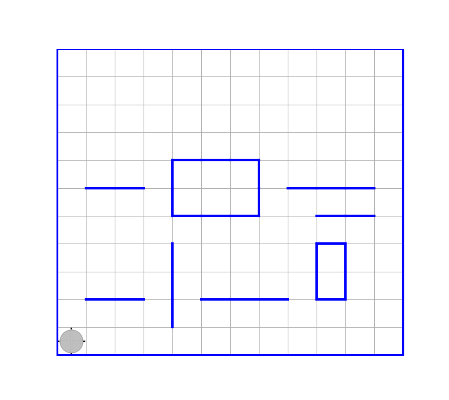

# Лекция 11

Примеры решения задач с использованием обобщенных функций, задающих перемещения Робота по полю (продолжение)

- [Лекция 11](#лекция-11)
  - [Задача подсчета числа внутренних прямолинейных горизонтальныхп ерегородок](#задача-подсчета-числа-внутренних-прямолинейных-горизонтальныхп-ерегородок)
  - [Задача подсчета числа внутренних перегородок прямоугольной формы за исключением перегородок в виде вертикальных отрезков](#задача-подсчета-числа-внутренних-перегородок-прямоугольной-формы-за-исключением-перегородок-в-виде-вертикальных-отрезков)
  - [Задача подсчета числа внутренних перегородок прямоугольной формы](#задача-подсчета-числа-внутренних-перегородок-прямоугольной-формы)
  - [Задача определения наибольшей площади внутренних перегородок прямоугольной формы](#задача-определения-наибольшей-площади-внутренних-перегородок-прямоугольной-формы)

## Задача подсчета числа внутренних прямолинейных горизонтальныхп ерегородок

Пусть на ограниченном прямоугольном поле имеются внутрениие прямолинейные горизонтальные перегродки. Требуется подсчитать их количество.

Чтобы не отвлекаться на малосущественные детали будем исходить из того, что Робот изначально сразу находится в юго-западном углу. Соответствующий пример начальной обстановки: 

Следующая функция высшего порядка возвращает интерфейс, содержащий две функции, замыкающие переменную-счетчик числа перегородок, с помощью которых эта задача может быть решена непосредственно.

```julia
"""
interface_fold_borders(robot, direct_borders)

-- robot - именованный кортеж функций (интерфейс), включающий функции:
 move!(side) (перемещает Робота на 1 клетку в заданном направлении), isborder(side)

-- direct_borders - главное направление движения, перпендикулярное складкам "змейки"

-- возвращает именованный кортеж функций (интерфейс), состоящий из 2х функций:
    move!(side), get_num()

Функция get_num() возвращает ОБЩЕЕ число перегородок, мимо которых прошел Робот с помощью
функции move!(side)

Описание функции move!:

ДАНО: в направлении direct от Робота перегородки нет
side - направление перемещения, перпендикулярное направлению direct

РЕЗУЛЬТАТ: в направлении direct от Робота ПОПРЕЖНЕМУ НЕТ перегородки,
но Робот прошёл мимо очередной перегородки, если таковая имелась на его пути,
а если таких перегородок не было, то он росто дошел до упора.
При этом, если в направлении side имелась преграждающая путь перегородка, то Робот остался на месте.
Если Робот сделал шаг, то возвращено true, если остался на месте, то возвращено false

Внешняя (замыкаемая) переременная увеличивается при этом 1, если была пройдена новая перегородка, или, в противном случае, 
её значение остаётся без изменения
"""

function interface_fold_borders_counter(robot, direct_borders)
    # robot = interface_save_robot(...) | interface_rectangular_borders(...) || ....
    num_borders = 0

    function move!(side)
    #=
        ДАНО: в направлении direct_borders от Робота перегородки нет
        side - направление перемещения, перпендикулярное направлению direct_borders
        РЕЗУЛЬТАТ: в направлении direct_borders от Робота ПОПРЕЖНЕМУ НЕТ перегородки, 
        но Робот прошёл мимо очередной перегородки, если таковая имелась на его пути, 
        а если таких перегородок не было, то он дошел до упора, 
        или Робот остался на месте, если в направлении side имелась перегородка.
        Если Робот сделал шаг, то возвращено true, если остался на месте, то возвращено false
    =#  
        while !robot.isborder(direct_borders) # || state==1
            if robot.move!(side)==false # robot.move!(side)==true <=> перемещение состоялось (Робот не уперся во внешнюю рамку)
                return false
            end
        end
        # УТВ: в направлении direct_borders имеется перегородка
        num_borders+=1
        while robot.isborder(direct_borders)
            robot.move!(side)
        end
        #УТВ: Робот - стоит за этой перегородкой
        return true
    end

    return (move! = move!, get_num = ()->num_borders)
end
```

Пусть этот код содержится в файле ["interface_fold_borders_counter.jl"](../11/interface_fold_borders_counter.jl)

Главную функцию, вызывающую этот код на исполнение, поместим в файл ["num_horizon_bordrs.jl"]()

```julia

module NumBorders
    export get_num_borders!

    include("../10/horizonside.jl")
    include("../10/functional_robot.jl")
    include("interface_fold_borders_counter.jl")

    function get_num_borders!(robot)
        robot = interface_save_robot(robot)

        horizont_borders_counter = interface_fold_borders_counter(robot, Nord)
        trajectories = interface_trajectories(robot)

        trajectories.snake!(Ost, Nord) do side
            if robot.isborder(Nord)
                return false
            end
            while horizont_borders_counter.move!(side) ||robot.move!(side)
            end
        end

       return horizont_borders_counter.get_num()
    end
end # module NumBorders

#-------Исполняемая часть файла:
using .NumBorders
using HorizonSideRobots

robot = Robot("11/horizontal_borders.sit", animate=true)

get_num_borders!(robot) |> println
```

Из REPL этот файл должен быть исполнен так:

```julia
julia> include("11/num_horizon_borders.jl")
9
```

## Задача подсчета числа внутренних перегородок прямоугольной формы за исключением перегородок в виде вертикальных отрезков

Если предположить, что на поле имеются перегородки прямоугольной формы, не вырождающиеся в отрезки. Тогда полученное в пердыдущем пункте решение не подойдёт. Во-первых, потому что некоторые перегородки будут попадаться на пути Робота, и их необходимо будет обходить. А во-вторых, - потому, что если Робот перемещаясь по горизонтальным рядам считает только перегородки, находящиеся над ним, то вертикальеых отрезков он при подсчете не "заметит" (но обходить их все-равно потребуется).

Пример соответствующей обстановки: 

Для обхода прямоугольных перегородок мы можем использовать интерфейс, возвращаемый разработанной нами ранее функцией высшего порядка `interface_rectangular_borders(robot)`, находящейся в файле ["10/functional_robot.jl"](../10/functional_robot.jl).

Следующий код будет подсчитывать число всех перегородок, за исключением перегородок в виде вертикальных отрезков, если такие имеются на поле.

```julia

module NumBorders
    export get_num_borders!

    include("../10/horizonside.jl")
    include("../10/functional_robot.jl")
    include("interface_fold_borders_counter.jl")

    function get_num_borders!(robot)
        robot = interface_save_robot(robot)

        horizont_borders_counter = interface_fold_borders_counter(robot, Nord)
        rectangular_borders = interface_rectangular_borders(robot)
        trajectories = interface_trajectories(robot)

        trajectories.snake!(Ost, Nord) do side
            if robot.isborder(Nord)
                return false
            end
            while horizont_borders_counter.move!(side) || rectangular_borders.move!(side)
            end
        end

       return horizont_borders_counter.get_num()
    end
end # module NumBorders

#-------Исполняемая часть файла:
using .NumBorders
using HorizonSideRobots

robot = Robot("11/horizontal_borders.sit", animate=true)

get_num_borders!(robot) |> println
```

Главную функцию, вызывающую этот код на исполнение, поместим в файл ["num_horizon_bordrs.jl"](num_rectangular_borders.jl)

Из REPL этот файл должен быть исполнен так:

```julia
julia> include("11/num_horizon_borders.jl")
7
```

## Задача подсчета числа внутренних перегородок прямоугольной формы

Для решения общей задачи подсчета общего числа прямоугольных перегородок всех видов остается только дополнить предыдущей код дополнительным подсчетом перегородок представляющих собой вертикальные отрезки. Эти перегородки Робут будет обнаруживать при горизонтальных перемещениях, упираясь в них. Приэтом в одну и ту же перегородку Робот может упираться по нескольку раз, перемещаясь по полю "змейкой". Поэтому важно, во-первых, считать каждую перегородку в виде вертикального отрезка только один раз. Во-вторых, проходя по горизонтальным рядам, Робот будет упираться и в перегородки прямоугольной формы. Однако эти перегородки он считает, когда проходит по сосоедниму с рими ряду под ними, и их не надо считать повторно. По этому надо уметь отличать вертикалные перегородки от прямоугольных.

Все это учтено в следующем коде, содержащем определение функции высшего порядка, возвращающей интерфейс, обеспечивающий подсчет вертикальных перегородок отдельно от всех остальных:

```julia
"""
interface_fold_borders(robot, direct_borders)

-- robot - именованный кортеж функций (интерфейс), включающий функции:
 count!() (перемещает Робота на 1 клетку в заданном направлении), isborder(side)

-- direct - главное направление движения, перпендикулярное складкам "змейки"

-- возвращает именованный кортеж функций (интерфейс), состоящий из 2х функций:
    count!(), get_num() 

Функция get_num() возвращает ОБЩЕЕ число перегородок, на которые наткнулся Робот (которые преграждают путь Роботу при движении по складкам)

Описание функции count!:

ДАНО: рядом с Роботом в направлении side находится перегородка
(side - направление перемещения Робот по складке)

РЕЗУЛЬТАТ: Робот в исходном положении и внешняя переменная с числом линейных перегородок, параллельных направлению direct, увеличено на 1,
если перегородка Рядом с роботом является отрезком, и эта внешняя переменная осталась без изменения, в противном случае
"""
function interface_general_borders_counter(robot, direct)
    num_borders = 0

    function count!(side)
        if robot.move!(inverse(direct)) == false
            return
        end
        if robot.move!(side)==false # c этой вертикальной перегородкой Робот уже встречался (т.е. она уже посчитана)
            robot.move!(direct)
            return
        end
        #Робот - за вертикальной частью перегородки
        if !robot.isborder(direct)
            num_borders+=1
        end
        robot.move!(inverse(side))
        robot.move!(direct)
    end

    return (count! = count!,  get_num = ()->num_borders)
end
```

Будем считать, что этот код размещен в файле ["interface_general_borders_counter.jl"](interface_general_borders_counter.jl)

Вот содержимое исполняемого файла ["num_borders.jl"](num_borders.jl)

```julia
module NumBorders
    export get_num_borders!

    include("../10/horizonside.jl")
    include("../10/functional_robot.jl")
    include("interface_fold_borders_counter.jl")
    include("interface_general_borders_counter.jl")

    function get_num_borders!(robot)
        robot = interface_save_robot(robot)

        horizont_borders_counter = interface_fold_borders_counter(robot, Nord)
        rectangular_borders = interface_rectangular_borders(robot)
        trajectories = interface_trajectories(robot)
        vertical_borders_counter = interface_general_borders_counter(robot, Nord)

        trajectories.snake!(Ost, Nord) do side
            if robot.isborder(Nord)
                return false
            end
            while horizont_borders_counter.move!(side) || (vertical_borders_counter.count!(side); rectangular_borders.move!(side))
            end
        end

        return horizont_borders_counter.get_num() + vertical_borders_counter.get_num()
    end
end # module NumBorders

#-------Исполняемая часть файла:
using .NumBorders
using HorizonSideRobots

robot = Robot("11/rectangular_borders.sit", animate=true)
get_num_borders!(robot) |> println
```

Этот файл может быть исполен из REPL:

```julia
julia> include("11/num_horizon_borders.jl")
8
```

## Задача определения наибольшей площади внутренних перегородок прямоугольной формы

Для решения задачи о определении наибольшей площади внутренних перегородо прямоугольной формы при тех же условиях на начальную обстановку на поле, разработана следующая функция высшего порядка, возвращающая интеррфейс, обеспечивающий это решение. Этот код во многом подпбен предыдущему, но отличается наличием трех замыкаемых переменных:
    `size_direct` - используется для вычисления вертикального размера очередной перегородки
    `size_side`  - используется для вычисления горизонтального размера очередной перегородки
    `area` - используется для фиксации значения площади очередной перегородки

```julia
"""
interface_borders_area(robot, direct)

-- robot - именованный кортеж функций (интерфейс), включающий функции:
 move!(side) (перемещает Робота на 1 клетку в заданном направлении), isborder(side)

-- возвращает именованный кортеж функций (интерфейс), состоящий из 2х функций:
    move!(side), get_area() 

Функция get_area() возвращает значение площади прямоугольной перегородки, полученное при выполнении 
функции move!(side)

Описание функции move!:

ДАНО: в направлении direct от Робота перегородки нет
side - направление перемещения, перпендикулярное направлению direct

РЕЗУЛЬТАТ: в направлении direct от Робота ПОПРЕЖНЕМУ НЕТ перегородки, 
но Робот прошёл мимо очередной перегородки, если таковая имелась на его пути, 
а если таких перегородок не было, то он росто дошел до упора. 
При этом, если в направлении side имелась преграждающая путь перегородка, то Робот остался на месте.
Если Робот сделал шаг, то возвращено true, если остался на месте, то возвращено false

Во внешнюю (замыкаемую) переременную записывается при этом значение площади пройденной перегородки
(если пройденной пергородки не было - Робот просто дошел до упора, то в этой переменной будет 0)
"""
function interface_borders_area(robot, direct)
    # robot = interface_save_robot(...) | interface_rectangular_borders(...) || ....

    size_direct = 0
    size_side = 0
    area = 0

    function move!(side)
        while !robot.isborder(direct)
            if robot.move!(side)==false # robot.move!(side)==true <=> перемещение состоялось (Робот не уперся во внешнюю рамку)
                area = 0 # ! нужно обнулить, т.к. не нулевое значение могло остаться после предыдущего вызова этой функции                 return false
                return false
            end
        end
        # УТВ: в направлении direct имеется перегородка

        while robot.isborder(direct)
            robot.move!(side)
            size_side+=1
        end
        #УТВ: Робот - стоит за этой перегородкой

        robot.move!(direct)
        while robot.isborder(inverse(side))
            robot.move!(direct)
            size_direct += 1
        end
        for _ in 1:size_direct+1
            robot.move!(inverse(direct))
        end
        # size_direct - определен, Робот - стоит за перегродкой в прежнем положении

        area = size_side*size_direct
        size_side, size_direct = 0, 0
        return true
    end

    return (move! = move!, get_area = ()-> area)
end
```

Будем считать, что этот код находится в файле ["interface_borders_area.jl"](interface_borders_area.jl).

Сдержимое соответсвующего исполняемого файла:

```julia
module NumBorders
    export get_max_area!

    include("../10/horizonside.jl")
    include("../10/functional_robot.jl")
    include("interface_borders_area.jl")


    function get_max_area!(robot)
        robot = interface_save_robot(robot)

        borders_area = interface_borders_area(robot, Nord)
        rectangular_borders = interface_rectangular_borders(robot)
        trajectories = interface_trajectories(robot)

        max_area = 0

        trajectories.snake!(Ost, Nord) do side
            if robot.isborder(Nord) 
                return false 
            end 
            while borders_area.move!(side) || rectangular_borders.move!(side)
                area = borders_area.get_area()
                if area > max_area
                    max_area = area
                end
            end
        end

       return max_area
    end
end # module NumBorders

#-------Исполняемая часть файла

using .NumBorders
using HorizonSideRobots

#robot = Robot("11/horizontal_borders.sit", animate=true)
robot = Robot("11/rectangular_borders.sit", animate=true)
get_max_area!(robot) |> println
```

Будем считать что этот код содержится в файле ["max_area_borders.jl"](max_area_borders.jl)

Этот файл может быть исполен из REPL:

```julia
julia> include("11/max_area_borders.jl")
6
```