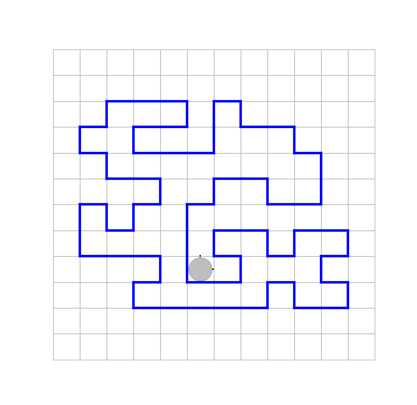

```julia
"""
ИЕРАРХИЯ ТИПОВ РОБОТОВ:

Any
|___Decart (интерфейс: coordinates!, coordinates)
|
|___AbstractRobot (интерфейс: isborder, putmatker!, ismarker, temperature, show!)
    |
    |___OrtRobot{TypeRobot} (дополнительные/переопределенные функции: forvard!, isborder, rotation!) - параметрический конкретный тип
    |
    |___AbstractRobotDecart (дополнительные функции: move!, coordinates)
        |
        |___RobotDecart{TypeRobot} - параметрический конкретный тип
        |
        |___GranRobot{TypeRobot} (forvard!, isborder, coordinates, num_steps, num_rotatins, ort, around!) - параметрический конкретный тип  

    
    
"""
module RobotTypes
    export AbstractRobot, AbstractRobotDecart, RobotDecart, OrtRobot, GranRobot, 
    move!, isborder, putmatker!, ismarker, temperature, show!, forvard!, rotation!, num_steps, num_rotations, ort, around!

    using HorizonSideRobots
    include("horizonside.jl")
    include("robot_types.jl")
end
```

[Файл "horizonside.jl"](horizonside.jl)

[Файл "robot_types.jl"](robot_types.jl)

Тесты

```julia
function around!(robot::GranRobot)
# Заставляет Робота, находящегося возле границы лабиринта, совершить ее полный обход и остановиться в исходном положении
    start_ort = ort(robot)
    start_coords = coordinates(robot)
    
    forvard!(robot)
    while coordinates(robot) != start_coords || ort(robot) != start_ort
        forvard!(robot)
        #putmarker!(robot)
    end
end

function around!(action::Function, robot::GranRobot)
# Заставляет Робота, находящегося возле границы лабиринта, совершить ее полный обход и остановиться в исходном положении,
# выполняя после каждого шага action()
    start_ort = ort(robot)
    start_coords = coordinates(robot)
        
    forvard!(robot)
    action()
    while coordinates(robot) != start_coords || ort(robot) != start_ort
        forvard!(robot)
        action()
    end
end
#-----------------------------------------------------------------------------

# Итератор для обхода границы:
Base.iterate(robot::GranRobot) = begin
    start_coordinates = coordinates(robot)
    start_ort = ort(robot)
    forvard!(robot)
    return robot, (start_coordinates, start_ort)
end 

Base.iterate(robot::GranRobot, state::Tuple) = begin    
    if state == (coordinates(robot), ort(robot))
        return nothing
    end
    forvard!(robot)
    return robot, state
end
```



[Файл "Test_RobotMaxTmpr.jl"](Test_RobotMaxTmpr.jl)


[Файл "Test_around_action.jl"](Test_around_action.jl)

## Итерируемые объекты

Итерируемые объекты (объекты итеририруемых типов), это объекты, которые определяют какую-либо последовательность (значений или состояний), и элементы которой можно перебирать в цикле **for**.

Примеры итерируемых обектов: массивы всех типов (Array), диапазоны (UnitRange), строки (String), множества (Set), словари (Dict), генераторы (Base.Generator)

Для того, чтобы неокоторый пользовательский тип сделать итерируемым типом, для него надо определить (переопределить) функцию Base.iterate.
Такая функция должна быть определена для всех итерируемых объектов, включая встроенные итерируемые ,типы.

Для функция iterate должно быть определено 2 метода: с одним аргументом, и с двумя аргументами. Первый аргумент в обоих случаях должен быть ссылкой на итерируемый объект, а второй, если он есть, - на текущее состояние итерируемого объекта.

Напирмер, приенительно к массивам, первый аргумент это - сам массив (ссылка на него), а второй аргумент, определяющее состояние (цикла) - индекс следующего элемента массива, который будет получен на очередном шаге цикла, или значение nothing, если следующего индекса уже нет.

В любом случае функция iterate возвращает кортеж из двух элементов: значение (в самом общем смысле этого слова) очередного элемента последовательности и очередное значение "состояния цикла":

```julia
iterate(iter [, state]) -> Union{Nothing, Tuple{Any, Any}}`
```

Пояснить механику работы цикла for, всегда основанную на использовании функции iterate, можно следующим образом.

Пусть `collection` - это некоторый (ЛЮБОЙ) итерируемый объект, определяющий некоторую последовательность каких либо значений (или состояний), т.е. объект типа, для которого определена функция `iterate`. Тогда конструкция: 

```julia

for x in collection
    ...
end
```

будет эквивалентна следующей конструкции:

```julia
let iter = iterate(collection) 

    while !isnothing(iter)
         x, state = iter
         ...
         iter = iterate(collection, state)
    end

end
```

Здесь функция `iterate` всякий раз возвращает кортеж из "следующего элемента" и "следующего состояния итерации" или значение `nothing`, если последовательность исчерпана.

Встроенная функция `isnothing` , возвращающая true, если ее аргумент имеет значение nothing.

При этом, использованная здесь стандартная конструкция языка `let-end` - предназначенная для ограничения области видимости, ограничивает область видимости переменной iter. Использование этой конструкции не принципиално с точки зрения понимания логики работы цикла на основе функции `iterate`.

[Файл "Test_iterate.jl"](Test_iterate.jl)

-------------------------------------------------------------------------------------------------------------------------------------

## Исполнитель, перемещающий Робота безопасно

Пользовательские типы + функции - против функций высшего порядка, возвращающих интерфейсы для взаимодействия с замкнутыми переменными

Мы уже неодноукратно пользовались функциями, переремещающими Робота в заданном направлении или "до упора" или на заданное количество шагов:

```julia
movements!(robot::Robot, side) = 
    while !isborder(robot, side) 
        move!(robot, side)
    end

movements!(robot::Robot, action::Function, side) = 
    while !isborder(robot, side)
        move!(robot, side)
        action() 
    end

movements!(robot::Robot, side, num_steps::Integer) = 
    for _ in 1:num_steps 
        move!(robot, side) 
    end

movements!(robot::Robot, action!::Function, side, num_steps::Integer) = 
    for _ in 1:num_steps 
        move!(robot, side)
        action!() 
    end

function get_num_movements!(robot::Robot, side)
    num_steps=0
    while !isborder(robot, side)
        move!(robot, side)
        num_steps+=1
    end
    return num_steps
end

function get_num_movements!(robot::Robot, action::Function, side)
    num_steps=0
    while !isborder(robot, side)
        move!(robot, side)
        action()
        num_steps+=1
    end
    return num_steps
end
```

Если мы хотим определить те же функции для Робота, умеющего выполнять "безопасные" перемещения (такие перемещения, как мы уже убеждались, полезны, если приходится программировать обходы препятствий), то для этого потребуется определить специалный абстрактный тип, от которого можно будет наследовать, в том числе и конкретные типы, необходимые для решения той или иной задачи, с безопасной функцией `move!`:

```julia
abstract type AbstractProtectedRobot <: AbstractRobot
    #robot::TypeRobot
end

HorizonSideRobots.move!(robot::AbstractProtectedRobot, side) = 
    if isborder(robot, side)
        return false
    else
        move!(robot.robot, side)
        return true
    end

movements!(robot::AbstractProtectedRobot, side) = 
    while move!(robot, side)==true 
    end

movements!(robot::AbstractProtectedRobot, action::Function, side) = 
    while move!(robot, side)==true 
        action() 
    end

movements!(robot::AbstractProtectedRobot, side, num_steps::Integer) = 
    for _ in 1:num_steps 
        move!(robot, side) 
    end

movements!(robot::AbstractProtectedRobot, action!::Function, side, num_steps::Integer) = 
    for _ in 1:num_steps 
        move!(robot, side)
        action!() 
    end

function get_num_movements!(robot::AbstractProtectedRobot, side)
    num_steps=0
    while move!(robot, side)==true
        num_steps+=1
    end
    return num_steps
end

function get_num_movements!(robot::AbstractProtectedRobot, action::Function, side)
    num_steps=0
    while move!(robot.robot, side)==true
        action()
        num_steps+=1
    end
    return num_steps
end
```

В частоности теперь можно определить конкретный тип:

```julia
struct ProtectedRobot{TypeRobot <: Union{Robot,AbstrctRobot}} <: AbstractProtectedRobot
    robot::TypeRobot
end
```

котроый наследует свой интерфейс от определенного выше абстрактнонго типа `AbstractProtectedRobot`, и передставляет собой просто тип-обертку Робота типа `TypeRobot`. В частности, можно положить `TypeRobot = Robot`, т.е. использовать тип `ProtectedRobot{Robot}`.

## Исполнитель, умеющий делать шаг в заданном направлении с обходом перегородки прямоугольной формы

Здесь будет определен конкретный параметрический тип, позволяющий перемещать Робота (того или иного типа) в заданном направлении с обходом внутренних перегородок прямоугольной формы на 1 шаг. Под "шагом" понимается перемещение Робота в заданном направлении в ближайшую доступную клетку (не обязательно она окажется соседней, соседняя клетка может оказаться недоступной).
 
```julia
struct RectangularBordersRobot{TypeRobot <: Union{Robot,AbstrctRobot}} <: AbstractProtectedRobot
    robot::TypeRobot
end

function move!(side)::Bool
# Перемещает Робота на один шаг в заданном направлении с обходом прямоугольной перегородки, если она стоит на пути
    num_steps = 0
    while isborder(robot, side) && !isborder(robot, left(side))
        move!(robot, left(side)) #!!!
        num_steps+=1
    end
    #УТВ: Робот стоит за краем перегородки, которую пытался обойти в поперечном направлении, или в углу, если это была внешняя рамка 

    ansver = move!(robot, side)
    if num_steps==0 # Робот не выполнял попытки обхода (перегородки на его пути не было)
         return ansver # == true
    end
    while isborder(robot, right(side))
        if isborder(robot, side)
            ansver = false # Робот уперся в угол (перегородка не является прямоугольной!)
            while isborder(robot, right(side))
                move!(robot, inverse(side))
            end
            #УТВ: Робот возвращен на уровень переднего фронта перегородки
            break
        end
        #УТВ: перегородка, возможно, является прямоугольной
        move!(robot, side)
    end
    #УТВ: Робот прошел сбоку от перегородки за её пределы
    protected_robot = ProtectedRobot(robot)
    movements!(protected_robot, right(side), num_steps)
    #УТВ: Робот возвращен на главную линию своего движения
    return ansver
end
```

Если теперь потребуется перемещать Робота по прямой линии с обходом прямоугольных пеегородок, встречающихся на пути, то для этого можно будет создать объект типа `RectangularBordersRobot{Robot}` и использовать для него функцию `movements!`. Это можно будет сделать вследствии того, что `ProtectedRobot{Robot} <: AbstractProtectedRobot`:

```julia
robot = Robot()
robot = ProtectedRobot{RobotRectangularBorders{Robot}}(robot)
movements!(robot, Ost)
```

Вместо Робота типа `Robot` мы могли бы аналогичным образом перемещать и Робота типа `RobotDecart{Robot}`, например.

## Исполнитель, умеющий делать шаг в заданном направлении с обходом прямолинейных полубесконечных перегородок

???????????????????????
 
## Исполнитель, перемещающий Робота "змейкой" по прямоугольному полю

```julia
mutable struct SnakeRobot{TypeRobot <: Union{Robot, AbstrctRobot}} <: AbstractRobot
    robot::TypeRobot
    fold_direct::HorizonSide
    genral_direct::HorizonSide
    is_begin_fold::Bool

    SnakeRobot{TypeRobot}(robot::TypeRobot, fold_direct, general_direct) where TypeRobot = new(robot,fold_direct, general_direct, true) 
end

is_begin_fold(snake::SnakeRobot) = snake.is_begin_fold

Base.iterate(snake::SnakeRobot) = begin
    return (snake, nothing)
end

Base.iterate(snake::SnakeRobot, state) = begin
    if isborder(snake, fold_direct) 
        if isborder(snake, general_direct)
            return nothing # змейка закончилась
        end
        move!(snake.robot, snake.general_direct)
        snake.fold_direct = inverse(snake.fold_direct)
        snake.is_begin_fold = true
    else
        move!(snake.robot, snake.fold_direct)
        snake.is_begin_fold = false
    end
    return snake, state # state == nothing
end

#=
function snake!(move_fold!::Function, robot::SnakeRobot, fold_direct::HorizonSide, general_direct::HorizonSide)
    if move_fold!(robot, fold_direct)==false
        return
    end
    while !isborder(robot, general_direct)
        move!(robot, general_direct)
        fold_direct = inverse(fold_direct)
        if move_fold!(robot, fold_direct)==false
            return
        end
    end
end # function snake!
=#
```

## Исполнитель, перемещающий Робота "змейкой" по простому лабиринту

```julia
#=
????????????????????????????????????????????????????????????????///
struct LabirintSnakeRobot{TypeRobot} <: AbstractRobot
    robot::TypeRobot
end

function labirint_snake!(move_fold!::Function, robot::LabirintSnakeRobot, fold_direct::HorizonSide, general_direct::HorizonSide)

    function to_next_fold!(general_direct)::Bool
    # перемещающает Робота в начало следующей "складки", если это возможно
        prew_direct = fold_direct
        fold_direct = inverse(fold_direct) # - внешняя переменная
        while isborder(robot, general_direct)
            if !isborder(robot, fold_direct)
                move!(robot, fold_direct) #!!!
            else
                return false # прохода в направлении general_direct нигде нет
            end
        end
        #УТВ: в направлении general_direct нет перегородки
        move!(robot, general_direct) #!!!
        while !isborder(robot, prew_direct)
            move!(robot, prew_direct) #!!!
        end
        return true
    end # function to_next_fold!

    if move_fold!(robot, fold_direct)==false
        return
    end
    while to_next_fold!(general_direct)==true
        if move_fold!(robot, fold_direct)==false
            return
        end
    end
end # function labirint_snake!
=#
```

----------------------------------------------------------------------------------------------------------

## Исполнитель, перемещающий Робота по спирали

```julia
mutable struct SpiralRobot{TypeRobot} <: AbstractRobot
    robot::TypeRobot
    side::HorizonSide
    max_num_steps::Int
    num_steps::Int
    num_rotations::Int
    SpiralRobot{TypeRobot}(robot) where TypeRobot = new(Robot,Nord,1,0,0)
end

Base.iterate(iter::SpiralRobot) = begin
    move!(spiral.robot,spiral.side)
    spiral.num_steps += 1
    spiral.side = left(spiral.side) 
    spiral.num_rotations += 1
    return (spiral, nothing)
end

Base.iterate(iter::SpiralRobot, state) = begin
    if spiral.num_steps == spiral.max_num_steps
        spiral.side = left(spiral.side)
        spiral.num_rotations += 1
    end
    move!(spiral.robot,spiral.side)
    if iseven(spiral.num_rotations)
        spiral.max_num_steps += 1
    end
    return (spiral, nothing)
end

#=
"""
spiral!(move_action!::Function)

-- move_action! - функция, перемещающая Робота в заданном направлении на БЛИЖАЙШУЮ следующую ДОСТУПНУЮ позицию при движеннии по спирали, или оставляющая Робота на месте.

В последнем случае движение Робота по спирали завершается, и функция возвращает значение false, в противном случае, возвращается true и движение по раскручивающейся спирали продолжается.
"""
function spiral!(move_action!::Function)

    function next_round!(side, max_num_steps::Integer) # - на очереном витке увеличивает длину сегмента спирали
        if side in (Sud, Nord)
            max_num_steps+=1
        end
        return max_num_steps
    end

    function move_direct!(move_action!::Function, side, max_num_steps::Integer)
    # перемещает Робота в заданном направлении не более чем на max_num_steps шагов с помощью функции move_act!(side) 
        num_steps=0
        while (num_steps <= max_num_steps)
            if move_action!(side) == false
                return false
            end
            num_steps+=1
        end
        return true
    end

    side = Nord
    max_num_steps = 1
    while move_direct!(move_action!, side, max_num_steps) == true
        max_num_steps = next_round!(side, max_num_steps)
        side=left(side)
    end
end # function spiral!
=#
```

## Исполнитель, запоминайщий путь пройденный Роботом, и умеющий возвращать его обратно в начальное положение

Исполнитель, запоминайщий путь пройденный Роботом, и умеющий возвращать его обратно в начальное положение был разработан в [лекции 6](../6/Лекция-6.md). Ооднако его реализация базировалась на использовании глобальных переменных специального модуля. Такое решение для языка julia считать естественным. Правильным подходом в языке Julia была бы разработка специалного типа данных (вместо модуля с глобальными переменными) с соответствующими функциями. Вот как это могло бы выглядеть

```julia
struct RobotPath{TypeRobot<:Union{Robot,AbstractRobot}} <: AbstractRobot
    robot::TypeRobot
    path_sides::Vector{HorizonSide}
    path_num_steps::Vector{Int}
    RobotPath{TypeRobot}(robot) where TypeRobot = new(robot, HorizonSide[], Int[])
end
   
"""
    move!(robot, side)

-- перемещает Робота в заданном направлении в соседнюю клетку
"""
function HorizonSideRobots.move!(robot::RobotPath, side)
    if isempty(robot.path_sides) || robot.path_sides[end]!=side
        push!(robot.path_sides, side)
        push!(robot.path_num_steps, 1)
    else
        robot.path_num_steps[end] += 1
    end
    move!(robot.robot,side) # - то, что эта инструкция выполняется последней, - это может быть существенно, если функция move! возвращает значение (отличное от nothing), логическое, например    
end

"""
    movements_to_back!(robot)

-- возвращает Робота из конца своего маршрута в исходное положение
"""
movements_to_back!(robot) = 
    for (i,side) in enumerate(reverse(robot.path_sides)) 
        movements!(robot.robot, inverse(side), reverse(robot.path_num_steps)[i]) 
    end```

Теперь, чтобы переместить Робота, находящегося где-то между внутренними перегродками прямоугольной формы, в юго-западный угол, а затем вернуть его в исходное положение, можно будет сделать так:

```julia
robot = Robot("файл с начальной обстановкой", animate=true)
robot_path = (robot |> RectangularBordersRobot{Robot} |> RobotPath{Robot})

while !isborder(robot,Sud) || !isborder(robot,West)
    movements!(robot_path, Sud)
    movements!(robot_path, West)
end
#УТВ: Робот - в юго-западном углу

movements_to_back!(robot_path)
#УТВ: Робот - в исходном положении
```

## Исполнитель, умеющий делать шаг при движении по спирали при наличии на поле перегородок в форме прямоугольников

??????????????
-----------------------------------------------------------------------------------------------------------------------------

## Рекурсия
