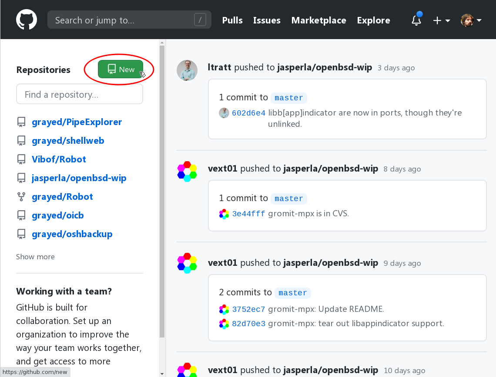
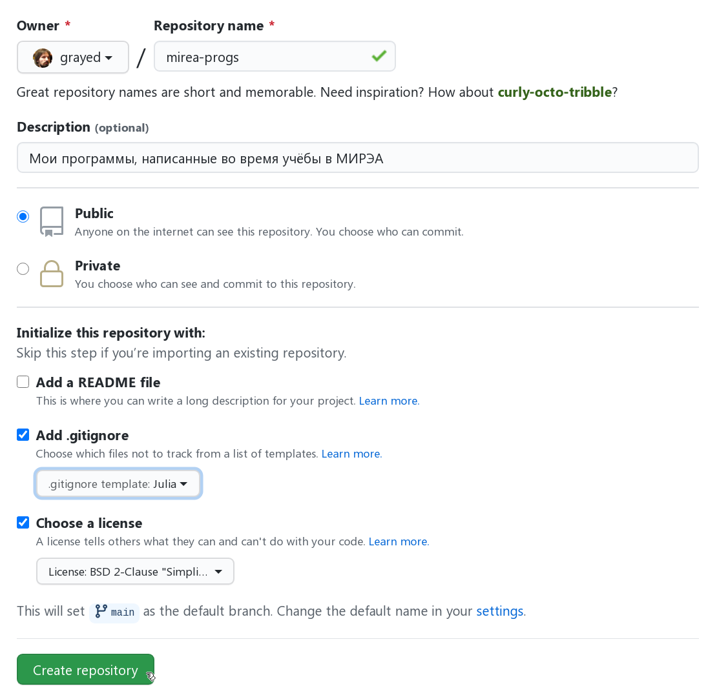

# Инструкция по организации процесса представления выполняемых заданий для контроля преподавателем

Организация учебного процесса предполагает использование системы контроля версий `git` и популярный интернет-сервис `github`, предоставляющий возможность создания программистами удаленных репозиториев для бесплатного хранения своих файлов.  

- [Инструкция по организации процесса представления выполняемых заданий для контроля преподавателем](#инструкция-по-организации-процесса-представления-выполняемых-заданий-для-контроля-преподавателем)
  - [Установка cистемы контроля версий git на компьтер](#установка-cистемы-контроля-версий-git-на-компьтер)
  - [Локальный и удаленный репозитории](#локальный-и-удаленный-репозитории)
    - [Создание учетной записи на github.com](#создание-учетной-записи-на-githubcom)
    - [Создание в учетной записи github.com нового репозитория](#создание-в-учетной-записи-githubcom-нового-репозитория)
    - [Клонирование удаленного репозитория на компьютер (создание локального репозитория)](#клонирование-удаленного-репозитория-на-компьютер-создание-локального-репозитория)
  - [Помещение в локальный репозиторий файлов со своими программами](#помещение-в-локальный-репозиторий-файлов-со-своими-программами)
  - [Способ взаимодействия с преподавателем на основе github](#способ-взаимодействия-с-преподавателем-на-основе-github)
  - [Принцип работы с github](#принцип-работы-с-github)

---------------------------------------------------

## Установка cистемы контроля версий git на компьтер 

Скачать git (это свободное и бесплатное программное обеспечение) следует с [официального сайта](https://git-scm.com/downloads) разработчиков. Убедиться в том, что всё работает, можно набрав команду `git` в консольном окне (удобнее всего будет использовать терминальное окно VS Code — cmd):
```julia
> git
usage: git [--version] [--help] [-C <path>] [-c <name>=<value>]
           [--exec-path[=<path>]] [--html-path] [--man-path] [--info-path]
           [-p | --paginate | -P | --no-pager] [--no-replace-objects] [--bare]
           [--git-dir=<path>] [--work-tree=<path>] [--namespace=<name>]
           <command> [<args>]

Стандартные команды Git используемые в различных ситуациях:

создание рабочей области (смотрите также: git help tutorial)
   clone             Клонирование репозитория в новый каталог
   init              Создание пустого репозитория Git или переинициализация существующего

работа с текущими изменениями (смотрите также: git help everyday)
   add               Добавление содержимого файла в индекс
   mv                Перемещение или переименование файла, каталога или символьной ссылки
   restore           Restore working tree files
   rm                Удаление файлов из рабочего каталога и индекса
   sparse-checkout   Initialize and modify the sparse-checkout
<...>
```

## Локальный и удаленный репозитории

---------------------------------

[<< к началу](#инструкция-по-организации-процесса-представления-выполняемых-заданий-для-контроля-преподавателем)

-------------------------

Репозитории бывают **локальными** (расположенными на локальном компьютере) и **удалёнными** (расположенными где-то в сети, например, на специальном ресурсе вроде GitHub).

Как должно быть уже ясно, на компьютере каждого студента должен быть локальный репозиторий, а и где-то в интернете должен располагаться соответствующий ему удаленный репозиторий.

Какой из них должен быть создан первым, а какой вторым - тут все зависит от ситуации, и в принципе может быть и так и так.

Здесь будет описана последовательность действий, начинающаяся с создания удаленного репозитория (пустого).


### Создание учетной записи на github.com

---------------------------------

[<< к началу](#инструкция-по-организации-процесса-представления-выполняемых-заданий-для-контроля-преподавателем)

-------------------------
Существует несколько интернет-сервисов, позволяющих создавать удалённые хранилища файлов. Самым популярным на сегодняшний день является [GitHub](https://github.com/), им мы и будем пользоваться.

Репозитории GitHub подразделяются на публичные (общедоступные) и на приватные (с ограниченным доступом для посторонних). Приватные репозитории используются в первую очередь организациями, которым нравятся сервисы GitHub, но не хочется делать доступным для посторонних исходный код разрабатываемых ими программ. Для работы в рамках курса каждый студент будет использовать публичный репозиторий (но каждый староста должен будет создать еще и дополнителный приватный репозиторий, о чем говорилось выше).

Если у вас ещё нет учётной записи на GitHub, следует её создать, вот ([наглядная инструкция](https://vertex-academy.com/tutorials/ru/kak-zaregistrirovatsya-na-github/)). 

### Создание в учетной записи github.com нового репозитория

---------------------------------

[<< к началу](#инструкция-по-организации-процесса-представления-выполняемых-заданий-для-контроля-преподавателем)

-------------------------

Далее, зайдя на сайт `github.com` следует, создать свой репозиторий (впринципе создать отдельных репозиториев можно сколько угодно, но для организации взаимодействия требуется какой-то один). 
На следующем рисунке представлен внешний вид web-интерфейса сайта github.com, на которм нужная кнопка обведена красным цветом:



Имя репозитория можно выбрать любое, например, «mirea-progs». 

Описание (description) репозитория не имеет никакого функционального значения, оно просто отображается в интерфейсе GitHub, так что можете написать там что угодно. 

В процессе создания нового репозитория (после нажатия кнопки `New`), появится возможность установить параметры репозитория, рекомендуется установит следующие значения параметров:



### Клонирование удаленного репозитория на компьютер (создание локального репозитория)

---------------------------------

[<< к началу](#инструкция-по-организации-процесса-представления-выполняемых-заданий-для-контроля-преподавателем)

-------------------------

После того, как был создан удалённый репозиторий его следует **клонировать** на свой компьютер.
Термин "клонирование" (`clone`)  в отличие от термина «копирование» (`copy`)  подчеркивает, что создавемый при клонировании локальный репозиторий — это не просто копия удалённого, но сохраняет (в своих настройках) связь с удалённым репозиторием. Всю фактическую работу следует производить в локальном репозитории и затем проталкивать (`push`) результаты работы на сервер. Такой подход позволяет не только в любой момент продолжить работу с другого компьютера, но и привлекать к разработке произвольное количество людей; в нашем случае, как минимум, преподавателя.

Клонирование производится командой:
```
  > git clone URI [папка]
```
где *URI* — (сетевой) путь к удалённому репозиторию, а *папка* — не обязательное для указание имя папки, в которую будет склонирован репозиторий. Если имя папки не указывать, то будет использовано название репозитория; сама папка при необходимости будет создана автоматически.

Допустим, что ваша учётная запись называется «ivanov», а репозиторий вы создали с названием «mirea-progs». Тогда команда для клонирования этого репозитория с GitHub будет выглядеть так:
```
  > git clone https://github.com/ivanov/mirea-progs.git
```

## Помещение в локальный репозиторий файлов со своими программами

---------------------------------

[<< к началу](#инструкция-по-организации-процесса-представления-выполняемых-заданий-для-контроля-преподавателем)

-------------------------

После первого клонирования можно (и нужно) переместить в локальный репозиторий все свои имеющиеся наработки.

**При этом ТРЕБУЕТСЯ, чтобы в каждом имени файла (папки) с программой присутствовал номер соответствующей задачи, например: `task_5.jl`, `task5/task_5.jl`.**

Решение задачи лучше помещать в отдельную папку, чтобы в ней наряду с кодом мог присутствовать и файл с исходной обстановкой на поле, который в случае задачи 5 должен называться task_5.sit.

Кроме того, формулировка задачи должна включаться в файл с кодом в виде педваряющего комментария.

## Способ взаимодействия с преподавателем на основе github

---------------------------------

[<< к началу](#инструкция-по-организации-процесса-представления-выполняемых-заданий-для-контроля-преподавателем)

-------------------------

В каждой группе следует выбрать одного ответственного человека. Это может быть староста группы, или кто угодно другой, но как бы там ни было, далее будем его называть "старостой". Желательно, конечно, что бы старостой оказался наиболее хорошо подготовленный в компьютерном отношении человек - идально, конечно, если он будет уже хоть немного знаком с git (но последнее - не обязательно).

Каждый староста должен будет создать один дополнительный приватный (!) репозиторий — для своей группы, с названием вида `mirea-kmbo-хх-хх`, и переслать его адрес своему преподавателю. В этом репозитории должен будет храниться файл `logins.md` следующего формата:

```
[Иванов Иван Иванович](https://github.com/IvanovIvan/mirea_progr) @IIvanov
[Петров Петр Петрович](https://github.com/PetrovPetr/mirea_progr) @PPetrov
[Сидоров Сидор Сидорович](https://github.com/SidorovSidor/mirea_progr) @SSidorov[Ахмедов Ахмед Ахмедович](https://github.com/AhmedovAhmed/mirea_progr) @AAhmedov)
...
...
```
Разумеется, в каждой такой записи логин сайта github, имя репозитория и имя пользователя telegram - могут быть любыми, здесь в примерах они условные. Но переносов строки там быть не должно, каждая запись - на одной стоке (длина строки может быть любой).

Предполагается, что каждый студент группы, предварительно создав свой собственный репозиторий на сайте `github`, сформирует свою собственную строку такого вида, в точности следуя указанному шаблону, и перешлет ее старосте. А староста должен будет просто вставлять эти строи в файл `logins.md`, по мере получения новых строк. Для простоты можно просто каждую новую полученную строку добавлять в конец файла (который должен находиться на компьтере старосты в отдельном локальном репозитории), не соблюдая алфавитного порядка. И каждый раз фиксировать изменения, и отправлять их на соответствующий удаленный репозиторий `https://github.com/mirea-kmbo-хх-хх`. Как это делать - написано в [отдельной инструкции](#краткая-справочная-информация-о-некоторых-командах-git). Поскольку данные действия необходимо будет освоить всем без исключения, то на старосту ложится не такая уж и большая дополнительная нагрузка (просто придется 25 раз, условно говоря, выполнить одну и ту же несложную последовательность действий).

Кроме этого, староста должен будет разрешить своему преподавателю, как пользователю GitHub (в нашем случае - с логином Vibof), доступ к этому репозиторию. Тут надо иметь в виду, что данный репозиторий должен быть **приватным** (чтобы не разглашалась личные данные в виде ФИО), а лимит для бесплатных приватных репозиториев — это всего три учётные записи, могущих иметь доступ к данному репозиторию. Поэтому лишних разрешений на доступ давать нельзя, иначе преподаватель может оказаться без права доступа.


## Принцип работы с github

---------------------------------

[<< к началу](#инструкция-по-организации-процесса-представления-выполняемых-заданий-для-контроля-преподавателем)

-------------------------

В общих чертах рабочий процесс будет состоять из следующей стандартной последовательности действий.

1. Внесение изменений в файл в локальном репозитории или добавление в него нового файла.
2. Включение этого файла в индекс репозитория (индексирование) с помощью команды
```
> git add task_5
```
или так:
```
> git add task_5/task_5.jl
```
В обоих случаях task_5 - это папка в локальном репозитории, содержащая файл или файлы подготовленные для отправки на сайт (или просто подготовленная пока только для сохранения в локальном репозитории). Во втором случае предполагается, что остальные файлы в папке task_5 (если они есть) никаких изменений не претерпели.

Если же отдельной папки для задачи нет, и файл task_5.jl находится непосредственно в папке локального 
репозитория, то данная команда выглядела бы так:
```
> git add task_5.jl
```
3. Фиксация текущего состояния проиндексированных файлов репозитория с помощью команды
```
> git commit -m "краткий однострочный комментарий с описанием внесенных изменений"
```
или, может быть, с помощью команды
```
> git commit
```
если требуется многострочный комментарий, описывающий внесенные изменения.
4. Отправка зафиксированного состояния локального репозитория в хранилище github.com с помощью команды
```
> git push
```
5. В случае если вы спми или преподаватель внесли какие-либо правки в удаленном репозиории непосредственно на сайте github.com, то чтобы получить эти изменения в свой локальный репозиторий и продолжить с ним работу, необходимо будет выполнить команду
```
> git pull
```
ВНИМАНИЕ. Если этого своевременно не сделать, а продолжить редактировать файлы в своем локальном репозитории,
то может возникнуть конфликтная ситуация, способ выхода из котрой описан в [краткой инструкции](Краткая_справка_по_git.md) 

Чтобы избегать таких ситуаций данную команду стоит выполнять сразу, как только возникнет предположение о возможных изменениях, произведенных в удаленном репозитории (лишнее выполнение этой команды ничему не повредит).

Все описанные здесь команды git выполняются из терминального окна VS Code (из окна cmd).

При необходимости более сновательно понять смысл перечисленных дейстыий следует ознакомиться с составленной для этого [краткой инструкцией](Краткая_справка_по_git.md), которая позволит осуществить "быстрое вхождение" в git.

Также, для более глубокого изучения git имеется [электронный учебник](https://git-scm.com/book/ru/v2),  котроый доступен в том числе и на русском языке (там на сайте, слева, имеется возможность выбрать язык). 

Однако чтение этого учебника можно пока отложить до "лучших времен", для наших целей вполне достаточно будет той краткой инструкции.

---------------------------------

[<< к началу](#инструкция-по-организации-процесса-представления-выполняемых-заданий-для-контроля-преподавателем)

-------------------------