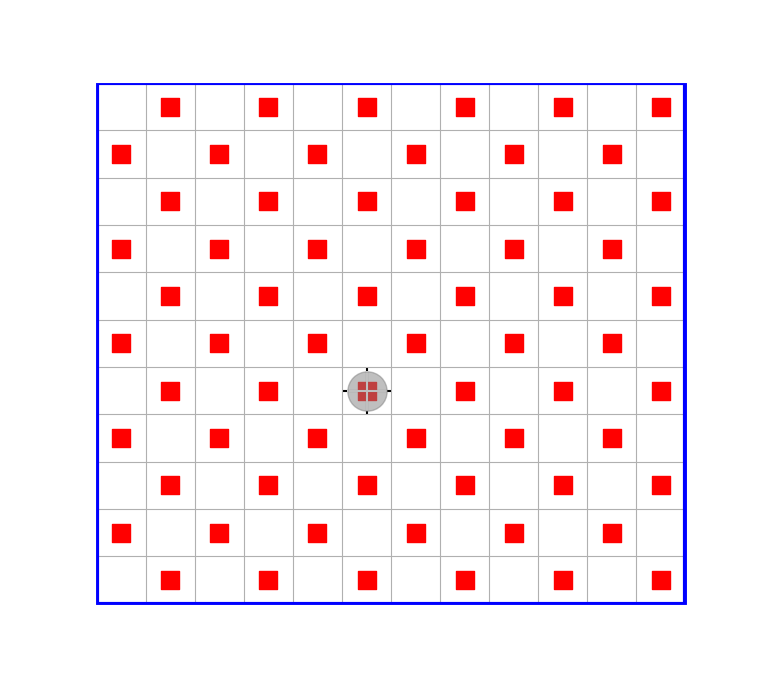

# ЛЕКЦИЯ 3
- [ЛЕКЦИЯ 3](#лекция-3)
  - [**Статическая и динамическая типизация**](#статическая-и-динамическая-типизация)
  - [**Вывод типа**](#вывод-типа)
  - [**Cсылки на объекты**](#cсылки-на-объекты)
  - [**Автоматическая сборка "мусора"**](#автоматическая-сборка-мусора)
  - [**Mножественная диспетчеризация**](#mножественная-диспетчеризация)
  - [**Глобальные переменные модуля**](#глобальные-переменные-модуля)
    - [**Пример программы, использующей глобальную переменную**](#пример-программы-использующей-глобальную-переменную)
    - [**Цель инкапсуляции данных и функций в модуль**](#цель-инкапсуляции-данных-и-функций-в-модуль)
    - [**Замечание о использовании глобальных переменных**](#замечание-о-использовании-глобальных-переменных)
    - [**Рекомендация по отладке модуля**](#рекомендация-по-отладке-модуля)
  - [**Локальные переменные функций**](#локальные-переменные-функций)
    - [**Пример программы, использующей функции с локальными переменными**](#пример-программы-использующей-функции-с-локальными-переменными)
    - [**Пример не слишком удачного выбора решения с использования глобальных переменных**](#пример-не-слишком-удачного-выбора-решения-с-использования-глобальных-переменных)
  - [**Функции с аргументами, передача параметров в функцию "по значению" и "по ссылке"**](#функции-с-аргументами-передача-параметров-в-функцию-по-значению-и-по-ссылке)

## **Статическая и динамическая типизация**

Что такое переменная в языках программирование?
**Переменная** - это именованное значение.

В таких языках программирования, как, например, С/C++, переменная всегда связывается с некоторой ячейкой памяти нужного размера, и эта связь постоянна. Например, если в программе на языке C сделано объявление:
```c
int num
```
то последующее присваивание
```c
num=0
```
означает, что значение 0 помещается в выделенную ячеку памяти.
Если далее, в том же блоке программы, будет присваивание
```c
num=1
```
то новое значение будет записано в **ту же самую** ячейку памяти.
Однако присваивание переменной `num` значенния другого типа
```c
num=1.0 // значение с плавающей точкой типа double
```
компилятор не разрешит.

Такой принцип типизации переменных называется **статической** типизацией.

В языках Julia и Python, напротив, типизация является **динамической**. Это означает, что с именем переменной никакой тип не связан постоянно. Но тип всегда есть у значения, с которым в данный момент ассоциируется соответствующая переменная.

Так, например, в следующем присваивании создается переменная целого типа
```julia
julia> num=1 # -тип Int=Int64 
```
Но далее будет возможно и такое присваивание
```julia
julia> num=1.0 # - тип Float64 (в языке С этот тип называется double)
```
Это приведет к тому, что будет создана новая ячейка памяти соответствующего типа, в новую ячейку памяти будет помещено значение 1.0, и этой ячейке памяти будет приписано имя `num`.
Возможно будет и такое присваивание
```julia
julia> num="one" # - тип String
```
Такая гибкость динамических языков в некоторых ситуациях может иметь преимущество, но это также может быть и источником замедления выполнения программы на языке Julia. Это связано с тем, что **нестабильность типа переменной будет препятствовать компилятору генерировать эффективный код**, и поэтому при стремлении к максимальной производительности кода Julia следует избегать действий, приводящих к нестабильности типа.

Отличие статических языков от динамичестких имеется еще и втом, что в статических языках переменная имеет тип только на этапе компиляции, а в процессе выполнения программы информации о типах переменных уже нигде нет. А в динамических языках тип переменной существует и во время испонения программного кода. Так в языке Julia, проверить, какой тип имеет та или иная переменная, всегда можно с помощью встроенной функции typeof,
например:
```julia
nun="one"
julia> typeof(mum)
String
```

------------------------
[<< к началу](#лекция-3)

------------------------

## **Вывод типа**

В языке C, например, типы переменных требуется указывать явно.
Однако в современных языках программирования, не только в динамических, но и в языках со статической компиляцией, без таких объявлений вполне обходятся. Речь идет о том, что тип создаваемой переменной, может быть **выведен** из выражения в правой части оператора присваивания.

Так, например, запись значения в виде последовательности десятичных цифр (возможно, - со знаком в начачале) означает значение типа Int64, запись с десятичной точкой - значение типа Float64, сторка в двойных кавычках - значение типа String, и т.п.

А если, например, имеется запись
```julia
x=sin(1.5)
```
то тип переменной `x` будет выведен на основании имеющейся информации от том, значение какого типа возвращает функция `sin`.

Это делает исходный код программы более легким для восприятия (менее "зашумленным", как принято говорить).

------------------------
[<< к началу](#лекция-3)

------------------------

## **Cсылки на объекты**

Простые (не составные) переменые, т.е. переменные всех числовых типов, лгического типа Bool, символьного типа Сhar и др., всегда представляют собственно значения этих типов.
Это значит, что, например, в результате следующей цепочки присваиваний
```julia
a=0
b=a
a=1
```
значение переменной `b` останется ракным 0. Это будет потому, что, при присваивании `b=a` произошло создание новой ячейки памяти для переменной `b` и копирование в нее содержимого переменной `a`. А после этого как в переменную  `a` было записано новое значение, в переменной `b` ничего не изменилось, потому что она связана с другой ячейкой памяти.

Совсем иначе обстоит дело при работе с переменными, типы которых представляют составные значения, например - массивы.

Пусть
```julia
a=[10,30,20,40,0]
b=a
a[1]=0
```
тогда окажется, что и `b[1]` - есть 0.
Происходит это потому, что в переменных, представляющих массивы, содержатся не сами массивы, а только ссылки на объекты в памяти, в которых размещены элементы массивов.
Ссылка на объет - это такое значение, которое содержит в себе, в том числе, и адрес, по которому объект размещен в памяти. 
Поэтому присваивание `b=a` привело к тому, что в переменную `b` была скопирована всего лишь ссылка, содержащаяся в `a`, и теперь обе переменнвые ссылаются на один и тот же объект в памяти.  

Для копирования составных объектов  в языке Julia имеется специальная функция copy. Например,
```julia
a=[10,30,20,40,0]
b=copy(a)
a[1]=0
prin(b[1])
0
```
Но функция `copy` выполняет только "поверхностное" копироване. Для обычных массивов она годится, но вот чтобы скопировать, скажем, массив массивов, потребуется функция "глубокого" коприрования `deepcopy`. То же самое имеет место и в языке Python.

Использование ссылок вместо значений для составных объектов позволяет избавляться от лишних затрат на копирование объектов (которые могут быть очень большими) при передаче их в функции в качестве фактических параметров.

Пусть, например, имеется функция суммирующая элементы массива
```julia
function sum(array)
    s=0
    for a in array
        s+=a
    end
    return s
end
```
Если бы массивы представлялись не ссылками, а собственно своими значениями, то при вызове
```julia
x=[10,20,30,40]
y=sum(x)
```
все элементы внешнего массива `x` должны были бы быть сначала скопированы во внутренний массив `array`, а затем уже его элементы были бы просуммированы. Но благодаря тому, что массивы представляются ссылками, такое предварительное копирование не происходит.

Например, известный нам конструктор типа Robot возвращает ссылку на создаваемый в памяти объект.

------------------------
[<< к началу](#лекция-3)

------------------------

## **Автоматическая сборка "мусора"**

Пусть, например, 
```
r=Robot()
r=0
```
Здесь сначала в переменную `r` записывается ссылка на созданный объкт типа Robot, а затем в туже переменную записывается число 0. Спрашивается, а что стало с созданным объектом типа Robot, который был размещен в памяти. Проблема в том, что ссылки на этот объект у нас больше нет, на ее место записано число 0, и поэтому взаимодейчтвовать с этим объектом возможности больше не имеет. Этот объект превратился просто в "баласт" бесподезно расходующий память.

В языке программирования C/C++, такая ситуация называется **утечкой памяти**. И если она происходит многократно, например, в каком-нибудь цикле многократно создается новый объект, а затем каждый раз ссылка на него утрачивается, так что в последствии занимаемую созданными объектами память невозможно будет даже освободить для последующего использования (потому что сылок на эти фрагменты памяти не осталось), то рано или поздно может возникнуть катастрофическая ситуация, когда свободной памяти, необходимой для работы программы, больше не станет.

Язык Julia (как и Python) относится к числу языков с **автоматической "сборкой мусора"**. В таких языках объекты, на которые ни в каких переменных программы больше не содержится ссылок, автоматически удаляются из памяти (на самом деле, эта память просто делается доступной для использования, т.е. она "освобождается"). И в таких языках проблемы утечки памяти не существует.

------------------------
[<< к началу](#лекция-3)

------------------------

## **Mножественная диспетчеризация**
Вот есть команда Робота
```lulia
move!(r::Robot,side::HorizonSide)
```
которая заставляет его сделать ровно один шаг в заданном направлении.

А если для решения какой-либо задачи понадобится сделать зададанное число (>=1) в заданном направлении, то мы могли бы написать функцию с тем же самым именем, но с дополнителным параметром для числа шагов
```julia
function move!(r::Robot,side::HorizonSide,num_steps::Int) 
    for _ in 1:num_steps # здесь символ _ используется мвесто имени переменной, котрая в теле цикла не требуется
        move!(r,side)
    end
end
```
Также, в какой-то ситуации может потребоваться функция, котрая будет делать не один шаг в заданном направлени, а серию шагов в заданной последовательности направлений. Последовательность направлений может быть задана, например, кортежем, содержащем требуемые направления. Тогда мы также могли бы написать соответствующую функцию с именем, которое бы с именами двух предыдущих функций.
```julia
function move!(r::Robot,sides::Tuple{HorizonSide}) 
    for s in sides
        move!(r,s)
    end
end
```
Отличие этой последней функции от стандартной команды робота в том, что второй аргумент имеет тип Tuple{HorizonSide} - кортеж значений типа HorizonSide, тогда как у стандартной команды второй аргумент имеет тип просто HorizonSide. А от предыдущей функции отличие еще и в числе аргументов.

В результате мы имеем три разные функции с одним и тем же именем. Следуя терминологии языка Julia, про это следует говорить, что функция move! имеет три метода. Какой метод из трех должен быть вызван - определяется набором типов соответствующих фактических параметров.

Такое свойство языка называется **множественной диспетчеризацией** (multiple pipatch). Оно имеется далеко не во всех языках программирования, например, в Python его нет. Но это свойство удобно тем, что позволяет единобразно называть функции, выполняющие близкие по смыслу действия. 

Точнее говоря, в классических объектно-ориентированных языках подобная возможность тоже существует, но она привязывается только к типу первого аргумента функции. А если тип первого аргумента сохраняется прежним, то именовать функцию приходится иначе, не смотря на наличие у нее дополнительных аргументов, или - на отличия в типах других аргументов. Множественная же диспетчеризация - она потому и множественная, что не относится только к первому аргументу, а распространяется на все аргументы функции. 

------------------------
[<< к началу](#лекция-3)

------------------------

## **Глобальные переменные модуля**

Модуль в языке Julia определяет пространство имен, т.е. имена различных программных сущностей (переменных, функций, типов), определенные в данном модуле могут использоваться только в пределах модуля и за его прделами, как принято говорить, не видны. 

Вообще, конструкция модуля имеет вид

```julia 
module ИмяMодуля
    ....
    ....
    ....
end
```

Например:
```julia
julia> a=0
julia>  module ModuleName
            a=1 # - это гдлобальная переменная модуля
            f(x)=x^2 + a # глобальная переменная может быть использована в теле любой функции модуля 
        end
julia> a
0

julia> ModuleName.a
1

julia> f(2)
ERROR: UndefVarError: f not defined

julia> ModuleName.f(2)
5
```
На самом деле область видимости REPL - это область модуля с именем Main, который опрделен изначально.
Т.е. определенный нами модуль ModuleName является вложенным в модуль Main.

Все именованные сущности, определенные в модуле, в частности переменные (но не только они),  в пределах модуля являются **глобальными** по отношению к функциям, также определяемым в этом модуле.

В частности, все переменные, определяемые непосредственно в теле какого-либо модуля, называются его **глобальными переменными**.

Например, в модуле Main можно определить
```julia
julia> a=0
julia>  function f()
           a=1
        end
julia> f()
julia> a
1
```
Переменная `a` является глобальной переменной модуля `Main`.

------------------------
[<< к началу](#лекция-3)

------------------------

### **Пример программы, использующей глобальную переменную**
Для примера рассмотрим задачу 7.

    ДАНО: Робот - в произвольной клетке ограниченного прямоугольного поля (без внутренних перегородок)
  
    РЕЗУЛЬТАТ: Робот - в исходном положении, в клетке с роботом стоит маркер, и все остальные клетки поля промаркированы в шахматном порядке



```julia
# task7.jl
include("roblib.jl")
# файл roblib.jl содержит определения функций: 
#   move!(::Robot,::HorizonSide,::Int) или обобщенный вариант move!(::Any,::Any,::Any) - тут важно, что аргумента 3, а не 2
#   moves!(::Robot,::HorizonSide) или обобщенный вариант moves!(::Any,::Any)

module ShessMark
    using HorizonSideRobots
    import Main.moves!, Main.inverse
#=
    После выполнеия include("roblib.jl") имена функций moves!, inverse оказались в пространстве имен Main
    и теперь их от туда необходимо импортировать в наш модуль
=#
    export mark_chess

    FLAG_MARK = nothing

    function mark_chess(r)
        global FLAG_MARK 
        # Глобальные переменные, ввиду их особой важности, следует именовать заглаными буквами. 
        # Объявление переменной как global требуется, только если ее значение ИЗМЕНЯЕТСЯ в теле функции, 
        # использоваться же она может и без такого объявления

        num_hor = moves!(r,West)
        num_vert = move!(r,Sud)
        #УТВ: Робот - в юго-западном углу
        FLAG_MARK = odd(num_hor+num_vert) ? true : false
        # значение FLAG_MARK определяет, нужно ли в юго-западном углу ставить маркер

        side = Ost
        mark_chess(r,side)
        while isborder(Nord)==false
            move!(r,Nord); FLAG_MARK = !FLAG_MARK
            side = inverse(side)
            mark_chess(r,side)
        end
        #УТВ: Робот - у северной границы поля И маркеры расставлены в шахматном порядке

        for side in (West,Sud) moves!(r,side) end
        #УТВ: Робот - в юго-западном углу

        move!(r,Ost,num_hor)
        move!(r,Nord,num_vert)
        #УТВ: Робот - в исходном положении
    end

    function mark_chess(r,side)
        global FLAG_MARK
        while isborder(r,side)==false
            if FLAG_MARK == true
                putmarker(r)
            end
            move!(r,side); FLAG_MARK = !FLAG_MARK
        end
    end
end
```
Теперь, чтобы запустить функцию mark_chess(r), требуется сделать следущее.

```julia
julia> using HorizonSideRobot
julia> r=Robot(animate=true)
julia> include("chess.jl")
julia> using .MarkChess
julia> mark_chess(r)
```
------------------------
[<< к началу](#лекция-3)

------------------------

### **Цель инкапсуляции данных и функций в модуль**
[Инкапсуляция](https://ru.wikipedia.org/wiki/инкапсуляция) 

Инкапуляция глобальных переменных и функций в модуль делается с целью ограничения доступа из вне к глобальной переменной (чтобы огради их от возможных ошибочных изменений), скрыть от пользователя модулем его внутреннее устройства (чтобы было удобнее и проще пользоватся), скрыть имена вспомогательных функций (т.к. за пределами модуля эти функции все-равно использованы быть не могут, потому что используют глобальные переменные модуля).

### **Замечание о использовании глобальных переменных**

Если в программе используются глобальные переменные, то правильным решением будет поместить их, и использующие их функции, в отдельный модуль. 
При этом глобальные переменные, в виду их особой важности, следует именовать заглавными буквами, и давать им имена, ясно отражающее их назначения, разделяя слова, в каждом таком имени символом "_".

При разработки программы не следует злоупотреблять использованием глобальных переменных, т.к. их наличие делает функции модуля взаимосвязанными, ограничивает их универсальность, усложняет отладку, а также, в случае их неразумного использования, может сделать программный код сложным для понимания.

Часто вместо глобальных переменных более простым и более предпочтительным решением будет использование соответствующих параметов функций.

Ниже будет приведен пример кода, в котором не следовало бы использовать глобальные переменные.

------------------------
[<< к началу](#лекция-3)

------------------------

### **Рекомендация по отладке модуля**

Если в теле модуля внести какие-либо изменения, то даже после повторного импортирования модуля они не вступят в силу - будет продолжать действовать прежний вариант. 
Чтобы изменения вступили в силу, необходима перезагрузка REPL.
Это неудобно, поэтому лучше действовать так, строчки с заголовком модуля и с соответствующем ему словм "end" следует сначала закомментирвать.
Тогда этот файл фактически не будет содержать определения отдельного модуля (следовательно и using .MarkChess - тоже выполнять в REPL будет не надо). В результате перезагрузка REPL при отладке кода не потребуются. 
Оформлять же код в виде модуля нужно уже только после того, как все будет отлажено.

------------------------
[<< к началу](#лекция-3)

------------------------

## **Локальные переменные функций**

В противоположность этому, усли в теле какой-либо функции определить некоторую именованную программную сущность, например, переменную, то область видимости данного имени будет ограничена телом функции.

Например
```julia
julia>  function f()
            b=100
            return b
        end
julia> f()
100

julia> b
ERROR: UndefVarError: b not defined
```

В этом смысле переменные, определяемые в теле какой-либо функции называются ее **локальными переменными**

Переменная `b` является локальной переменной функции `f`.

**ВАЖНО понимать, что локальные переменные размещаются в памяти ровно в момент вызова функции на исполнение, и по завершению ее исполнения, из памяти автоматически удаляются.** Механизм этого мы обсудим чуть позже. 

------------------------
[<< к началу](#лекция-3)

------------------------

### **Пример программы, использующей функции с локальными переменными**

Пусть требуется решить следующую задачу (задача 10).
    ДАНО: Робот - в юго-западном углу поля, на котором расставлено некоторое количество маркеров

    РЕЗУЛЬТАТ: Функция верула значение средней температуры всех замаркированных клеток

```julia
function mean_markers_temperature(r::Robot)
    sum_temperatures, num_markers = get_sum_temperatures(r)
    return sum_temperatures/num_markers
end

function get_sum_temperatures(r::Robot)
    side=Ost
    sum_temperatures, num_markers = get_sum_temperatures(r,side)
    while isborder(r,Nord)==false
        move!(r,Nord)
        side=inverse(side)
        part_sum, part_num = get_sum_temperatures(r,side)
        sum_temperatures+=part_sum
        num_markers+=part_num
    end
    return sum_temperatures, num_markers
end 

function get_sum_temperatures(r::Robot,side::HorizonSide)
# список аргументов этой функции отличается от списка аргументов предыдущей функции, поэтому Julia будет  
# знать, какой именно метод функции get_sum_temperatures должен быть вызван

    #=
        if ismarkers(r)==false
            sum_temperatures=0
            num_markers=0
        else
            sum_temperatures=temperature(r)
            num_markers=0    
        end
    =# 
    
    #Но вместо предыдущего можно написать короче:

    init_values(r) = ismarkers(r) ? (0,0) : (temperanure(r), 1)
    sum_temperatures, num_markers = init_values(r)

    while isborder(r,side)==false
        if ismarker(r)==true
            sum_temperatures += temperature(r)
            num_markers += 1
        end
    end
    return sum_temperatures, num_markers 
end
```
Рассмотрим теперь подробнее, что же будет происходить в памяти компьютера в результате вызова главной функции на выполнение.

В результате вызова
```julia
julia> mt= mean_markers_temperature(r)
```
этой функции будет выделена память, в которой будут размещены все ее локальные переменные

    ОБЛАСТЬ ПАМЯТИ ФУНКЦИИ mean_markers_temperature(::Robot)
        r (это не сам объект типа Robot, а только ссылка на него)
        sum_temperatures
        num_markers

Затем, при сохранении этой области памяти будет вызвана подпрограмма get_sum_temperatures(::Robot).
В результате и этой подпрограмме будет выделена отдельная область памяти, где разместятся ее локальные переменные:

    ОБЛАСТЬ ПАМЯТИ ФУНКЦИИ get_sum_temperatures 
        r (это копия прежней ссылки на Робота)
        sum_temperatures 
        num_markers
        part_sum
        part_num

**Имена некоторых переменных в этой области совпадают с именами локалных переменных функции mean_markers_temperature, но это физически совсем другие переменные, с теми напрямую не связанные.**

Данная область памяти просуществет только до тех пор, пока не завершится сделанный вызов функции get_sum_temperatures. Как только вызов завершится возвратом результата, эта область памяти будет уничтожена.

Но далее в цикле снова происходит вызов той же функции, и снова буд выделена ей область памяти для размещения ее локальных переменных. А после каждой итерации цикла эта обоасть памяти снова будет удаляться, а на следующей итерации - снова выделяться, и так до завершения цикла.

------------------------
[<< к началу](#лекция-3)

------------------------

### **Пример не слишком удачного выбора решения с использования глобальных переменных**

Разобранную выше задачу 10 можно было бы решить еще и так, используя для суммирования температур замаркированных клеток и числа таких клеток соответствующие глобальные переменные.
```julia
SUM_TEMPERATURES=0
NUM_MARKERS=0

function mean_markers_temperature(r::Robot)
    get_sum_temperatures(r)
    return SUM_TEMPERATURES/NUM_MARKERS
end

function get_sum_temperatures(r::Robot)
    side=Ost
    get_sum_temperatures(r,side) 
    # теперь приставка get в имени функции уже не уместна, так как она уже ничего не возвращает, 
    # но прежнее имя оставлено без изменений для облегчения сопоставления двух решений
    while isborder(r,Nord)==false
        move!(r,Nord)
        side=inverse(side)
        get_sum_temperatures(r,side)
    end
end 

function get_sum_temperatures(r::Robot,side::HorizonSide)
    global SUMT_EMPERATURES, NUM_MARKERS

    while isborder(r,side)==false
        if ismarker(r)==true
            SUMT_EMPERATURES += temperature(r)
            NUM_MARKERS += 1
        end
    end
end
```
Однако такое решение следует считать **не слишком удачным**, хотя оно и выглядит, может быть, немнго короче.
**Во-первых**, потому что теперь по тексту функций, использующих подпрограммы, стало труднее понять что же они делают, без того чтобы досконально не вникнуть в устройство этих подпрограмм. В результате получается, что невозможно думать о этих функция независимо друг, а надо сразу же целиком держать всю задачу в голове
(задача тут, не такая уж и сложная, конечно, так что это все еще возможно, но тем не менее).

**Во-вторых**, функция get_sum_temperatures(r::Robot,side::HorizonSide), например, из-того, что теперь она использует глобальные переменные, перестала быть универсальной, пригодной для решения каких-то других задач, где тоже требовалось бы просуммировать температуры маркеров одного ряда и посчитать их количество.

**В-третьих**, отлаживать подпрограммы независимо друг от друга стало намного проблематичнее, т.к. они теперь стали связаны друг с другом общими (глобальными) переменными.

------------------------
[<< к началу](#лекция-3)

------------------------

## **Функции с аргументами, передача параметров в функцию "по значению" и "по ссылке"**

Если функция имеет аргументы, и при вызове этой функции ее фактические параметры будут иметь простые значения (например - числовые, или логические), то эти значения будут использованы для инициализации соответствующих локальных переменных. **Фактически имеет место копирование этих значений в область памяти, выделяемой функции на время ее выполнения. В этом случае говорят, что параметры в функцию передаются по значению**. Например

```julia
function f(x,y)
    z=x
    x=x+y
    println(x)
    y=z-y
    println(y)
    return sin(x)+cos(y)
end
```
Функция f имеет 4 локальных переменных: `x`, `y`, `z`
Все локальные переменные создаются (размещаются в памяти) в момент вызова функции.

Например, при вызове функции
```julia
julia> f(1.0, 2.0);
3.0
-1.0
```
локальная переменная x сначала получит значение 1.0, а локальная переменная y - значение 2.0., а затем в этих переменных появятся значения 3.0 и -1.0, соответственно.

А если сделать, например, так
```julia
julua>  x=1.0
1.0
julia>  y=2.0
2.0
julia>  z=f(x,y);
```
то внешние переменные x, y cохранят свои исходные значения:

```julia
julia> x
1.0
julia> y
2.0
```
 
Однако, если значение аргумента функции представляет собой массив (или, может быть, составное значение какого-либо другого типа), то само это значение уже не будет копироваться в область памяти, выделяемой функции, а будет копироваться лишь ссылка на этот массив.

Например, пусть
```julia
function g(x)
    x[1]=x[end]
    return x
end
```
Тогда
```julia
julia> A=[1,2,3]
3-element Array{Int64,1}:
 1
 2
 3
julia> B=g(A)
3-element Array{Int64,1}:
 3
 2
 1
julia> A
3-element Array{Int64,1}:
 3
 2
 1
```
Т.о. внешний массив оказался измененым, потому что функция получила ссылку на этот массив, и в ее теле по ссылке было выполнено соответствующее присваивание.

------------------------
[<< к началу](#лекция-3)

------------------------