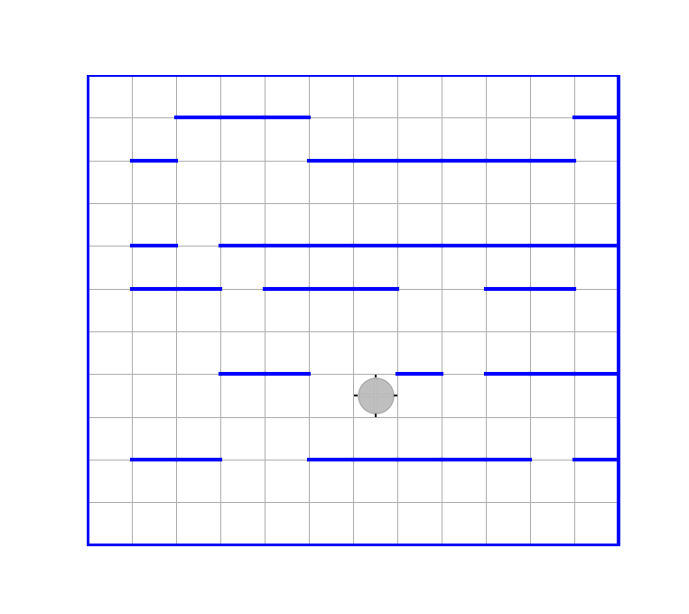
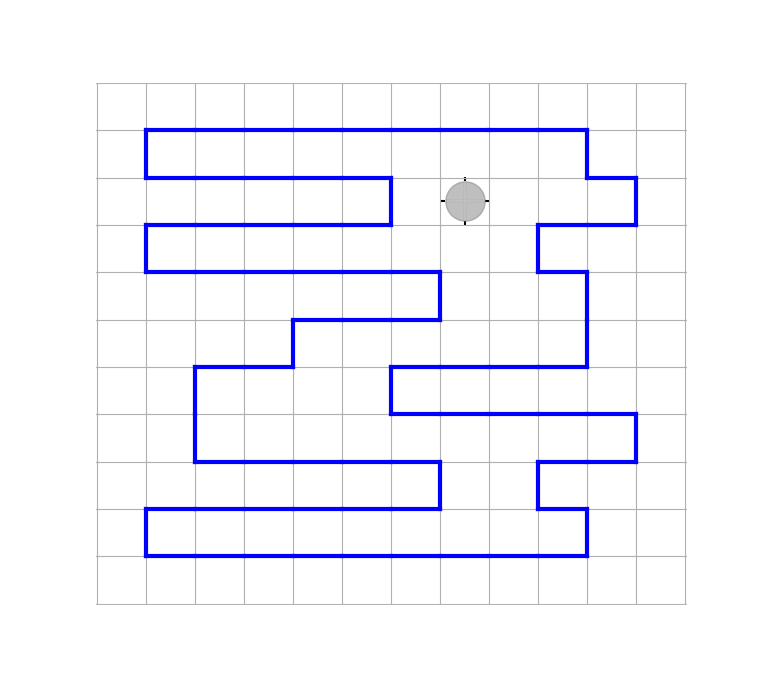

# Задача 28-31

28. В [лекции 6](Лекция-6.md) был спроектирован модуль `StartBack` с двумя функциями `move_to_start!` и `move_to_back!`, с помощью которых робот может быть перемещен из начального положения в стартовый угол, а затетем, после решения основной задачи и возвращения в стартовый угол, перемещен в исходное положение. Однако в реализации этих функций не было предусмотрено наличие внутренних перегородок на поле. 
Требуется, модернизировать этот модуль так, чтобы его можно было бы использовать и при решении задач, услия которых предполагает возможность наличия на поле внутренних изолированных перегородок прямоугольной формы (некоторые такие прямоугольники могут вырождаться в отрезки).

29. Начертить в отдельном графическом окне план расположения перегородок, считая, что точка центра поля совпадает с началом координат, оси координат параллельны линям широты и долготы, и что размер клетки поля на чертеже равен 1.
Вначале Робот находится в произвольной клетке поля, в конце он снова в исходном положени.

Указание: использовать графическую библиотеку `Plots.jl`
Для этого ее надо сначала скачать с github.com

```julia
julia>]
pkg> add Plots.jl
```

А после этого её можно будет импортировать:

```julia
julia> using Plots
```

Чтобы построить график плоской ломаной линии, декартовы координаты узловых точек которой находятся, например, в векторах `xdata` и `ydata`, в этом пакете предусмотрена функция `plot`.
После ее вызова с соответствующими фактическими параметрами

```julia
p=plot(xdata,ydata)
```

в памяти компьюиера буддет создан объект p с данными графика. Отобразтися ли при этом график в графическом окне или нет - это зависит от того, где было исполнено  `p=plot(xdata,ydata)`. Если непосредственно в REPL, то график отобразится, если - в теле какой-либо функции, вызываемой из REPL, то для того чтобы график отобразился требуется чтобы функия возвращала (в REPL) значение p (в функции должно быть return p). Если же  `p=plot(xdata,ydata)` было исполнено в какой-дибо подпрограмме, вызываемой главной функцией, то необходимо, чтобы эта подпрограмма возвращала в вызывающуюю ее функцию объект p, а та, в свою очередь, должна возвратить его в REPL. Без этого график не отобразится.

Если требуется в уже построеннный график добавить еще одну кривую, то для этого предусмотрена функция `plot!`. Пусть например переменные `xdata` и `ydata` содержат массивы координат нового графика, который требуется добавить к уже существующему в объекте p, тогда следует выполнить:

```julia
plot!(p, xdata,ydata)
```

Более полную информацию по графическому пакету Plots можно найти [здесь](https://docs.juliaplots.org/latest/tutorial/)

30. На прямоугольном поле имеются прямолинейные горизонталные перегородки, которые на западе гарантированно не касаются внешней рамки, а на востоке такие касания возможны. Изначально Робот находится в произвольной клетке, в результате все поле должно быть замаркировано, и Робот должен находиться в исходном положении. Постараться минимизировать число шагов Робота.



31. Робот находится где-то внутри лабиринта, граница которого обладает следующим свойством: любая горизонтальная прямая пересекает границу ровно 2 раза (а произвольная вертикальная прямая пересекает ее любое четное число раз).
Требуется подсчитать число имеющихся на поле маркеров (функция должна это число возвращать) и возвратить Робота в исходное положение.

