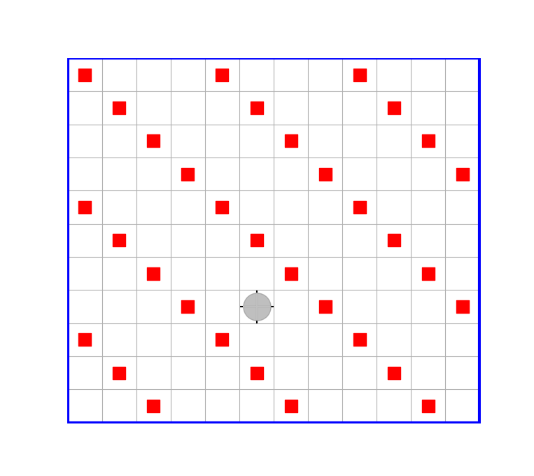

# ЛЕКЦИЯ 6

- [ЛЕКЦИЯ 6](#лекция-6)
  - ["Ленивые" логические операции && и ||](#ленивые-логические-операции--и-)
  - [Разбор задачи 26](#разбор-задачи-26)
  - [Модульное программирование](#модульное-программирование)
    - [Задача перемещения Робота в стартовый угол и обратно](#задача-перемещения-робота-в-стартовый-угол-и-обратно)
    - [Еще раз о задаче 7 с точки зрения модульного программирования](#еще-раз-о-задаче-7-с-точки-зрения-модульного-программирования)
  - [Вложенные функции](#вложенные-функции)

## "Ленивые" логические операции && и ||

Рассмотрим выражение, содержащее дизъюнкцию вида:

```julia
Условие || Другое_условие_или_некоторое_действие
```

Если выражение `Условие = true`, то выражение `Другое_условие_или_некоторое_действие` вычисляться не будет, т.к. в этом случае заранее известно, что вся дизъюнкция будет иметь значение `true`. В противном случае оно будет вычислено (выполнено) и его значение будет значением всей дизъюнкции.

Аналогично, выражение, сожержащее конъюнкцию вида:

```julia
Условие && Другое_условие_или_некоторое_действие
```

Если выражение `Условие = false`, то выражение `Другое_условие_или_некоторое_действие` вычисляться не будет, т.к. в этом случае заранее известно, что вся коньюнкия будет иметь значение `false`. В противном случае оно будет вычислено (выполнено) и его значение будет значением все конъюнкции.

Использование "ленивое" поведение дизъюнкции конъюнкции, позволяет в некоторых случаях более компактно записывать код, без явного использования оператора ветвления.

Например:
выражение

```julia
Условие || Действие
```

эквивалентно выражению

```julia
if Условие == false
    Действие
else
    true
end
```

И, соответственно,
выражение

```julia
Условие && Действие
```

эквивалентно выражению

```julia
if Условие == true
    Действие
else
    false
end
```

## Разбор задачи 26

Пусть требуется расставить маркеры в "полосочку" (через n пустых "полосок"). Причем "полосочки" могут быть, в одном случае, "прямыми", а в другом - косыми. Считать, что внутренних перегородок на поле нет.




Иначе говоря, требуется написать **обобщенную функцию** (см. [лекцию 5](Лекция-5.md)), которая бы могла расставлять маркеры как по "прямым" (горизонтальным или вертикальнымм), так и по наклонным линиям (наклоны могут быть или в одну сторону или в другую).

УКАЗАНИЕ.
    Напишите сначала программу, имея ввиду, что полосы из маркеров на поле должны быть именно горизонтальными или вертикалными, но соблюдая при этом общие принципы написания обобщенного кода, следуя рекомендациям из [лекции 5](Лекция-5.md). А затем попробуйте использовать полученный код и для случая наклонных полос.

```julia
"""
    mark_zebra!(r, line_side, ortogonal_line_side, num_passes, num_start_passes)

Расставляет параллельные полосы из маркеров с заданным промежутком между ними и с задаеным промежутком между стартовым углом и первой полосой, и возвращает робота в исходное положение

-- r - cсылка на Робота
-- line_side - начальное направление вдоль полосы маркеров (оно должно инвертироваться от полосы к полосы) 
-- ortogonal_line_side - направление поперек полос с маркерами
-- num_passes - число пустых полос в промежутке между полосами с маркерами
-- num_start_passes - число пустых полос в промежутке между стартовым углом и первой полосой с маркерами

При этом стартовый угол определяется значениями line_side, ortogonal_line_side
"""
function mark_zebra!(robot, line_side, ortogonal_line_side, num_passes, num_start_passes=0)
    start_side = get_start_side(line_side,ortogonal_line_side)
    #УТВ: start_side - кортеж типа NTuple{2,HorizonSide}, например: (Sud,Ost)  

    nun_steps = [get_num_movements!(robot,start_side[i]) for i in 1:2]
    #УТВ: Робот - в стартовом углу

    movements_if_posible!(robot, ortogonal_line_side, num_start_passes) || return
    line_mark!(robot,line_side)
    #ИНВАРИАНТ: линия с Роботом и все предыдущие (по ходу движения в направлении ortogonal_line_side) замаркированы
    while movements_if_posible!(robot,ortogonal_line_side, num_passes) == true
        line_side = inverse(line_side)
        line_mark!(robot,line_side)
    end
    #УТВ: все линии замаркированы

    for s in start_side
        movements!(r,s)
    end
    #УТВ: Робот - снова в стартовом углу

    back_side=inverse(start_side)
    for (i,num) in arange(num_steps)
        movements!(robot,back_side[i], num)
    end
    #УТВ: Робот - в исходном положении
end

function movements_if_posible!(robot, side, max_num_steps)
    for _ in 1:max_num_steps
        isborder(robot,side) && (return false)
        move!(robot,side)
    end
    return true
end

function line_mark!(robot,side)
    putmarker!(robot)
    putmarkers!(robot,side)
end
```

Весь этот код является обобщенным, т.е. с помощью функции `mark_zebra!` можно получить как прямые, так и косые линии маркеров. Тут все будет зависеть от фактических типов её аргументов: `line_side`, `ortogonal_line_side`. Если эти аргуметы будут иметь тип HorizonSide, то линии получатся "прямыми", а если их тип будет `NTuple{2,HorizonSide}`, то линии будут "косыми".

Но для того, чтобы это было именно так, необходимо чтобы вспомогательные функции `get_start_side`, `isborder`, `move!` и `putmarkers!` имели бы соответствющие специализации, каждая из этих функций должна иметь по два метода для каждого из двух случаев.
В случае, когда у функции `mark_zebra!` фактические параметры `line_side` и `ortogonal_line_side` будут иметь тип `HorizonSide`, то актуальными будут методы:

```julia
get_start_side(line_side::HorizonSide,ortogonal_line_side::HorizonSide) = (line_side,ortogonal_line_side)
```

```julia
isborder(r::Robot,side::HorizonSide) # - это команда Робота, определена в модуле HorizonSideRobots

move!(r::Robot,side::HorizonSide)    # - это команда Робота, определена в модуле HorizonSideRobots

putmarkers!(r::Robot,side::HorizonSide) # - эта функция уже неодногкратно встречалась при решении задач, и можно считать, что ее определение уже содержится в roblib.jl
```

С использованием этих определений обобщенная функция `mark_zebra` будет расставлять маркеры по "прямым" линиям.

В случае же, когда у функции `matrk_zebra` фактические параметры `line_side` и `ortogonal_line_side` будут иметь тип `NTuple{2,HorizonSide}`, то актуальными будут методы:

```julia
get_start_side(line_side::NTuple{2,HorizonSide}, ortogonal_line_side::NTuple{2,HorizonSide}) = ortogonal_line_side
# первый аргумент здесь фактически не используется
```

```julia
isborder(r::Robot,side::NTuple{2,HorizonSide}) = isborder(r,side[1]) || isborder(r,side[2])

move!(r::Robot,side::NTuple{2,HorizonSide}) = for s in side move!(r,s) end

putmarkers!(r::Robot,side::NTuple{2,HorizonSide}) =
    while isborder(r,side)==false
        move!(r,side)
        putmatker!(r)
    end
```

И c использованием этих определений обобщенная функция `mark_zebra` будет расставлять маркеры уже по косым линиям.

## Модульное программирование

Модульное программирование - это подход к структуризации программного кода, когда  "кирпичиками", из которых складываются программы, являются уже не отдельные функции (или не только отдельные функции), а информационно связанные модули, включающие глобальные переменные и функции, работающие с этими глобальными переменными.

По сравнению с отдельными функциями модули представляют собой уже более крупные "строительные блоки". Использование модульного подхода к программированию направлено на повышение надежности и удобства использования ранее разработанного программного кода. Это избавляет пользователя модуля от необходимости держать в голове его внутреннее устройство, какие там используются глобальные переменные и как они взаимодействуют с функциями модуля.

### Задача перемещения Робота в стартовый угол и обратно

При решении наших задач мы постоянно сталкиваемся с двумя повторяющимися от раза к разу подзадачами:

- переместить Робота в стартовый угол
- вернуть Робота в исходное положение после выполнения основной задачи

У нас в этом вопросе были разные, незначительно отличающиеся друг от друга вариации. Последний раз мы это сделали по следующей схеме:

```julia
function главная_фунуция(....)
    num_steps = [get_num_movements!(robot,start_side[i]) for i in 1:2]
    #УТВ: Робот - в стартовом углу

    ..... # основной код

    for (i,num) in arange(num_steps)
        movements!(robot,back_side[i], num)
    end
    #УТВ: Робот - в исходном положении
```

Некоторый недостаток этого решения состоит в состоит из следующих двух моментов

- необходимо создать переменную `num_steps`, которая не участвует в основном коде и поэтому будет только понапрасну отвлекать внимание
- в конце программы, когда робота надо возвращать на место, надо будет каждый раз держать в голове способ, которым был "закодирован" обратный путь Робота, т.е. помнить, что кортеж back_side должен быть получен из кортежа start_side путем инвертирования  каждого состоавляющего его направления типа HorizonSide.

Хотелось бы, чтобы со всем этим делом можно было бы разобраться один раз и навсегда, и больше в детали этого вопроса не погружаться.

Это можно сделать, например, разработав специальный модуль.

Вот как это может выглядеть.

```julia

module StartBack
    import Main.inverse, Main.get_num_movements!, Main.movements!
    #=
        Предполагается, что функции inverse, get_num_movements!, movements! определены в пространстве имен Main
        (например, в результате выполнения include("roblib.jl"))
    =#
    export move_to_start!, move_to_back!
    NUM_STEPS=Int[]
    BACK_SIDE=(Nord,Ost)
    # - значения направлений в этом кортеже на самом деле будут переопределены, так что эти начальные значения фактически роли не играют

    """
        move_to_start!(robot,start_side::Tuple)

    -- перемещает Робота в угол, определенный кортежем  start_side, например (Sud,West), и возвращает 2-х элементный вектор, содержащий число сделанных шагов в каждом из этих направлений
    """
    function move_to_start!(robot, start_side::Tuple)
        global NUM_STEPS, BACK_SIDE
        BACK_SIDE = inverse(start_side)
        NUM_STEPS = [get_num_movements!(robot,start_side[i]) for i in 1:2]
    end

    """
        move_to_back!(robot)

    -- возвращает Робота из стартового угла в исходное положение
    """
    move_to_back!(robot) = for (i,num) in arange(NUM_STEPS) movements!(robot,BACK_SIDE[i], num) end
end
```

Этот модуль мы предполагам поместить в наш библиотечный файл `roblib.jl`, и в этом файле, мы предполагаем, находятся определения функций `get_num_movements!(::Any, ::HorizonSide)`,`inverse(::NTuple{2,HorizonSide}))`, `movements!(::Any, ::HorizonSide, ::Integer)`, которые используются при реализации функций нашего модуля.

Тогда использоание модуля `StartBack` в основном файле (каком-либо) будет выглядеть так:

```julia
include("roblib.jl")

using .StartBack # точка перед именем модуля поставлена потому что определение модуля теперь находится в текущем пространстве имен

function главная_функция(robot,...)
    start_side =  ... # тут должен быть определен кортеж из двух направлений типа HorizonSide, определяющий направление в стартовый угол

    move_to_start(robot, start_side)
    #УТВ: Робот - в стартовом углу

    ..... # основной код

    move_to_back(robot)
    #УТВ: Робот - в исходном положении
end
```

Такое решение полность избавляет от заботы о деталях перемещения Робота в стартовый угол и обратно при решении основной задачи.

Важно при этом отметить, что мы решили эту проблему с использованием **информационно связанного модуля**. В таком модуле ВСЕ входящие в него функции связаны между собой общими глобальными переменными.

Функции, которые не ипользуют глобальных переменных обычно не стоит помещать в такой модуль, они будут в нем "лишними".

### Еще раз о задаче 7 с точки зрения модульного программирования

В [лекции 3](../3/Лекция-3.md) была разобрана задача 7, в которой требовалось замаркировать клетки поля в шахматном порядке:

ДАНО: Робот - в произвольной клетке ограниченного прямоугольного поля (без внутренних перегородок)
  
РЕЗУЛЬТАТ: Робот - в исходном положении, в клетке с роботом стоит маркер, и все остальные клетки поля промаркированы в шахматном порядке

Рассмотрим полученный ранее программный код с решением этой задачи, сразу же внесем в него использование модуля `StartBack` для перемещения робота в стартовый угол и обратно.

```julia
# task7.jl
include("roblib.jl")
#=
    файл roblib.jl содержит определения функций:
    move!(::Robot,::HorizonSide,::Int) или обобщенный вариант move!(::Any,::Any,::Any) - тут важно, что аргумента 3, а не 2
    movements!(::Robot,::HorizonSide) или обобщенный вариант movements!(::Any,::Any)
=#

module ShessMark
    import Main.inverse, Main.movements!
    #=
        Предполагается, что функции inverse, movements! определены в пространстве имен Main
        (например, в результате выполнения include("roblib.jl"))
    =#
    import ..StartBack.move_to_start!, ..StartBack.move_to_back!
    #=
        Предполагается, что модуль StartBack был определен в том же пространстве имен, что и данный модуль ShessMark
        (поэтому и ..StartBack. - эти две точки в начале означают, что модуль StartBack надо искать в пространстве имен на 1 иерархичекий
        уровень выше данного)
    =#

    using HorizonSideRobots

    export mark_chess

    FLAG_MARK = false # здесь безразлично, какое именно значение присвоено, т.к. оно потом переопределяется

    function mark_chess(robot)
        global FLAG_MARK
        #=
            Глобальные переменные, ввиду их особой важности, следует именовать заглаными буквами.
            Объявление переменной как global требуется, только если ее значение ИЗМЕНЯЕТСЯ в теле функции,
            использоваться же она может и без такого объявления
        =#
        num_steps = move_to_start!(robot, (Sud,West))
        #УТВ: Робот - в юго-западном углу

        FLAG_MARK = odd(sum(num_steps)) ? true : false
        # значение FLAG_MARK определяет, нужно ли в юго-западном углу ставить маркер

        #=
            Можно было бы и не вводить локалную переменную num_steps, написав так:

        FLAG_MARK = odd(sum(move_to_start!(robot, (Sud,West)))) ? true : false

            или так:

        FLAG_MARK = (move_to_start!(robot, (Sud,West)) |> sum |> odd) ? true : false

        где |> - оператор, направляющий поток данных
        =#

        side = Ost
        mark_chess(robot,side)
        while isborder(Nord)==false
            move!(robot,Nord)
            side = inverse(side)
            mark_chess(robot,side)
        end
        #УТВ: Робот - у северной границы поля И маркеры расставлены в шахматном порядке

        for side in (West,Sud) movements!(robot,side) end
        #УТВ: Робот - в юго-западном углу

        move_to_back!(robot)
        #УТВ: Робот - в исходном положении
    end

    function mark_chess(r,side)
        putmarker!(r)
        while isborder(r,side)==false
            move!(r,side)
            putmarker!(r)
        end
    end

    function putmarker!(r)
        global FLAG_MARK
        if FLAG_MARK == true
            HjrizonSideRobots.putmarker(r)
        end
        FLAG_MARK = !FLAG_MARK
    end

end
```

Всегда желательно иметь наиболее компактный информационносвязанный модуль, т.е. использование глобальных переменных стоит локализовать в небольшом количестве специалных функций. Чтобы добиться этого в данном случае можно былобы организовать модуль несколько иначе, исключив из него главную функцию `mark_chess(::Any)`. Для этого, однако придется добавить в модуль еще одну маленькую функцию, с помощью которой будет инициализироваться глобальная переменная модуля.

Новая редакция модуля будет тогда выглядеть так:

```julia
module ShessMark
    using HorizonSideRobots

    export init, putmarker!

    FLAG_MARK = false # здесь безразлично, какое именно значение присвоено, т.к. оно потом переопределяется

    init(value::Bool) = (FLAG_MARK=value; nothing) # функция устанавливает заданное значение глобальной переменной и возвращает nothing

    function putmarker!(r)
        global FLAG_MARK
        if FLAG_MARK == true
            HorizonSideRobots.putmarker!(r)
        end
        FLAG_MARK = !FLAG_MARK
    end
end
```

В этот модуль помещены всего лишь две функции `init` и `putmarker!`, которые должны взаимодействовать с глобальной переменной.

А весь остальной код, включая главную функцию, определяемый после определения модуля в том же файле, тогда будет выглядеть так:

```julia
using .ShessMark, .StartBack

function mark_chess(robot)
    init(isodd(sum(move_to_start!((Sud,West)))) # isodd - возвращает true, если аргумент нечетный
    #УТВ: Робот - в юго-западном углу и глобальная переменная модуля инициализирована

    side = Ost
    mark_chess(robot,side)
    while isborder(Nord)==false
        move!(robot,Nord)
        side = inverse(side)
        mark_chess(robot,side)
    end
    #УТВ: Робот - у северной границы поля И маркеры расставлены в шахматном порядке

    for side in (West,Sud) movements!(robot,side) end
    #УТВ: Робот - в юго-западном углу

    move_to_back(robot)
    #УТВ: Робот - в исходном положении
end

function mark_chess(r,side)
    ShessMark.putmarker!(r) # здесь вызывается не стандартная команда Робота, а одноименная функция из модуля
    while isborder(r,side)==false
        move!(r,side)
        ShessMark.putmarker!(r)
    end
end
```

Вот так выглядит модульный подход к программированию.
Цель этого подхода все все в том же, в улучшении структуры кода, что облегчает его последую отладку, сопровождение (модернизацию) и восприятие, а также в том, чтобы облегчить последующее многократное использование один раз написанного и отлаженного кода.

## Вложенные функции

Функция называется вложенной (nested function), если она определена в теле другой функции.

```julia
function f(a,b,c,...)

    function g()
        x=...
        y=...
        z=...
        # локальные переменные a,b,c,... функции f здесь "видны"
        ....
    end

    u=...
    v=...
    # локальные переменные x,y,z,... вложенной функции g здесь "не видны"
    ....
end
```

Локальные переменные вложенной функции не видны внешней функции, но локальные переменные внешней функции, которые были определены до определения вложенной функции, видны в теле вложенной функции.

Обычно вложенные функции используются в связи с функциональным подходом к программированию, хотя это и не обязательно так.
