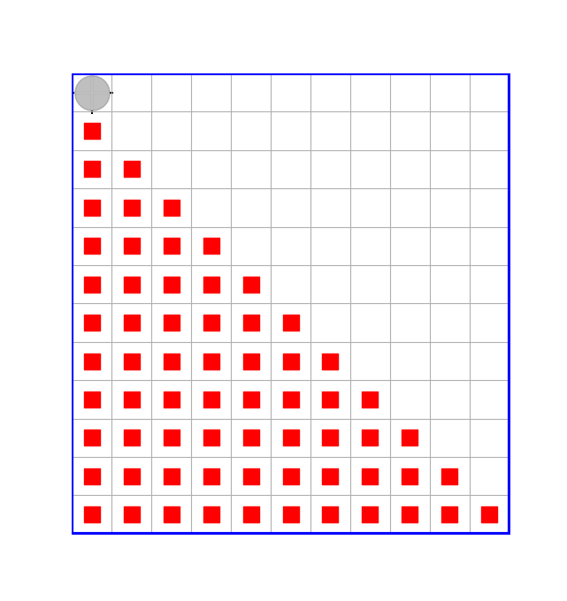
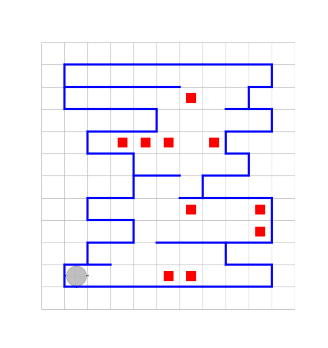

# Лекция 8

- [Лекция 8](#лекция-8)
  - [Переопределения стандартных команд Робота, замыкающих переменную типа Robot](#переопределения-стандартных-команд-робота-замыкающих-переменную-типа-robot)
  - [Программирование обобщенных прямолинейных перемещений Робота](#программирование-обобщенных-прямолинейных-перемещений-робота)
  - [Программирование обобщенных перемещений Робота по специальным траекториям](#программирование-обобщенных-перемещений-робота-по-специальным-траекториям)
  - [Модульное программирование](#модульное-программирование)
  - [Еще раз о использовании глобальных переменных](#еще-раз-о-использовании-глобальных-переменных)
  - [Примеры решения задач в функциональном стиле с использованием разработанных модулей](#примеры-решения-задач-в-функциональном-стиле-с-использованием-разработанных-модулей)
    - [Решение задачи о расстановке маркеров на ограниченном рамкой поле в форме прямоугольной трапеции](#решение-задачи-о-расстановке-маркеров-на-ограниченном-рамкой-поле-в-форме-прямоугольной-трапеции)
    - [Решение задачи о подсчете числа маркеров внутри простого лабиринта](#решение-задачи-о-подсчете-числа-маркеров-внутри-простого-лабиринта)

**Функциональный стиль** позволяет программировать в обобщенном виде, т.е. позволяет писать **обобщенные функции**, конкретное поведение которых будет определяться не столько содержащимся в их определениях кодом (хотя и им тоже, конечно), сколько типами их фактических параметров. В данном случае - параметров функционального типа, поскольку речь идет именно о функциональном программировании.

Напомним, что функциональное программирование основывается на использовании и проектировании функций высшего порядка, т.е. таких функций, у которых или среди аргументов имеются аргументы функционального типа (`<:Function`), и/или, возвращаемые ими значения  имеют функциональный тип.

При этом функции рассматриваются как объекты, равноправные с обычными объектами, т.е. в этом смысле являются объектами "первого класса". Это означает также, что функция может быть анонимной, т.е. представлять собой просто функциональное значение как таковое, без имени. Подобно тому, как может быть без имени, скажем, числовое значение, т.е. значение, не ассоцированное с переменной, а используемое непосредственно.

Важным также является понятие о "замыкании", т.е. о функции, "замыкающей" свои локальные переменные. Каждая такая функция, если её рассматривать как значение функционального типа, представляет собой одно целое с объектом, содержащим данные (соответствующие её локальным перемеенным). При этом этот объект сохраняется в памяти компьтера и после выполениия функции (замыкания). Таким образом результат выполнения такой функции будет зависеть от текущего состояния соответствующего объекта (которе при каждом новом вызове функции может изменяться).

## Переопределения стандартных команд Робота, замыкающих переменную типа Robot

В предыдущей лекции обсуждалось понятие замыкания функцией переменной.

В качестве примеров замыканий были приведены переопределения стандартных команд Робота, с целью сделать их более удобными для использования.

Эти определения, с нзначительными изменениями, мы поместим в файл ["_functional_robot.jl"](_functional_robot.jl).
Все содержащиеся в этом файле функци определенные в контексте глобальной переменной `ROBOT`, которой присваивается значение ссылки на объект типа `Robot`, которому соответствует "стандартная" обстановка (поле размером 11*12, внутренних пергородок нет, маркеров на поле нет, Робот - в юго-западном углу). Для замены этой обстановки на любую другую, предусмотрена функция `set_situation!`.

**ПРЕДУПРЕЖДЕНИЕ!!!! Функцию модуля `set_situation!`  может быть реализована только при использовании версии 0.3.1 и выше пакета HorizonSideRobots.**

Далее файл "_functional_robot.jl" мы обернем в модуль `FunctionalRobot`, который разместим в одноименном файле ["FunctionalRobot.jl"](FunctionalRobot.jl). И таким образом, мы изолируем содержимое файла "_functional_robot.jl" от глобальной области Main (с которой мы работаем в REPL непосредственно).

В начале файла с модулем обычно помещают его описание в виде многосточного комментария, которое после импортирования модуля (в REPL) будет выводится в REPL в режиме help:

```julia
julia>?
help?> Имя_предварительно_импортированного_модуля
```

Аналогично можно получить помощь по любой экспортируемой из модуля функции, если, конечно, её описание в виде многострочного комментария было помещено перед самым заголовком функци в файле, содержащем её определение.

## Программирование обобщенных прямолинейных перемещений Робота

Стандартная команда Робота `move` позволяет переместить Робота в соседнюю клетку в заданном направлении.
Однако чсасто приходится перемещать Робота в заданном направлении или до упора, или - в заданном направлении на некоторое заданное количество шагов. Часто приходится также перемещать Робота в заданном направлении до упора и возвращать число сделанных им при этом шагов.

Такие функции ранее мы уже не однократно использовали использовали, теперь только мы могли бы реализовать их на основе модуля `FunctionalRobot`, что даст более удобный (менее "защумленный") синтаксис.

Кроме того, обычно перемещения Робота сопряжены с какими-то дополнителными дейчтвиями (например, - с установкой маркеров, или с подсчетом чего-либо). В таких случаях ранее нам приходилось для каждого такого случая писать функцию, перемещающую Робота и доплнительно выполняющую те или иные действия. Однако теперь мы можем сделать функции, перемещающие Робота, обобщенными, снабдив их дополнительным параметром функционального типа, через который эти дополнительные действия можно будет определять в каждом специальном случае. Т.е. этих обобщенных функций в нашей библиотеке будет всего несколько, но они будут иметь дополнительный функциональный параметр.

Опркделения всех этих функций мы поместим в файл ["_movements_robot.jl"](_movements_robot.jl) и обернем его в модуль `MovementsRobot`, который поместим в одноименный файл ["MovementsRobot."](MovementsRobot.jl).

Стоит обратить внимание на то, что модуль `MovementsRobot` наследует от модуля `FunctionalRobot` все функции последнего. Т.е. если с помощью оператора `using` импортируется модуль  `MovementsRobot`, то все все функции, экспортируемые модулем `FunctionalRobot`, автоматически тоже становятся доступными. Это обусловлено тем, что в список экспорта модуля `MovementsRobot` были вкличены и все функции ипортированные внутри него из модуля `FunctionalRobot`.

## Программирование обобщенных перемещений Робота по специальным траекториям

При решении разнообразных задач мы уже столкивались с тем, что во многих случаях Робота приходится перемещать не только прямолинейно, но и, например, "змейкой", или "по спирали", или, быть может траектория движения Робота должна напоминать форму гребенки. Причем такого рода траектории перемещения Робота следует считать базовыми, поскольку на них основываны решения множества задач.

Раньше нам приходилось в каждой конкретной задаче каждый раз заново программировать такого рода перемещения. Но теперь мы постараемся написать соответствующие обобщенные функции, которые затем могут быть использованы при решении множества разнообразных задач и при этом в их код не придется каждый раз вносить каких-либо изменений. Т.е. будет соблюдаться принцип обобщенного программирования: один раз написанные обобщенные функции будут выполнять те или иные конкретные действия в зависимости от фактических типов их аргументов. В данном случае для этого будут предусмотрены атгументы абстрактного типа Function, т.е. планируемые обобщенные функции будут функциями высшего порядка.

Определения трёх обощеных функций, обеспечивающие перемещение Робота "змейкой", по "гребёнке", или по спирали, а именно функций `snake!`, `comb!` и `spiral!`, соответственно, мы поместим в файл ["_trajectories_robot.jl"](_trajectories_robot.jl), который обернем также в модуль `TrajectoriesRobot`, размещеный в одноименный файл ["TrajectoriesRobot.jl"](TrajectoriesRobot.jl).

**Стоит обратить внимание на то, что хотя модуль `TrajectoriesRobot` и базируется на модуле `MovementsRobot`, он не экспортирует функций последненго**.

Сделано это специально, потому что все функции для перемещений Робота реализованы в модуле `MovementsRobot` так, что они не предусматривает возможности обхода внутренних перегородок, но в некоторых случаях, возможно, мы захотим иметь функции, одноименные с с соответствующими функцями модуля `MovementsRobot`, которые такую возможность предусматривают. Причем совпадение имен соответствующих функций потребуется для обеспечения возможности  писать обобщенный код. В таком случае мы должны будем разаработать специальный модуль,содержащий и экспортирующий эти модифицированные функции, перемещающие Робота в заданном направлении с обходом внутренних перегородок.

Но тогда, если бы при импортировании модуля  `TrajectoriesRobot`, автоматически импортировались бы и функции модуля `MovementsRobot.move!`, а потом нам понадобиллось бы импортировать этот предполагаемый модуль, функции которого имеют те-же имена, но уже предусматривают обход внутренних перегородок, то будет возникникать связанный с этим конфликт имен. Так вот, наше решение, не импортировать фунции модуля `MovementsRobot.move!` автоматически,  при импортировании модуля `TrajectoriesRobot`, принято именно для предотвращения этого возможного конфликта.

## Модульное программирование

Программирование с использованием модулей для ограничения пространств имен и с использованием некоторой иерархии таких модулей называют модульным программированием. Модульное программирование позволяет создать желаемую структурную организацию програмного кода, обеспчивает возможность исключения конфликта имен, и при правильном использовании может обеспечивать основу для обобщенного прраммирования.

При этом модули, если в них используются глобальные переменные, представляются собой типичных исполнителей, внутренние состояния которых определяется состояниями их глобальных переменных, а их коммандые интерфейсы - экспортируемыми из них функциями.

При этом модули, как исполнители, могут образовывать некоторую иерархию: может быть родительский модуль (как, например, модуль `FunctionalRobot`), от которых производные модули наследуют часть своего коммандного интерфейса (как, например, модуль `MovementsRobot`).

Другие модули (как, например, модуль `TrajectotiesRobot`) могут использовать командный интерфейс некоторого базового (родительского) модуля, но не экспортировать во вне его функции (т.е. использовать их приватно (private), в отличие предыдущего случая, когда родительские функции используются открыто (public)).

При разработке модулей мы придерживались принципа, когда реализация модуля (его тело), в наших примерах это только реализация его функций и определение глобальных переменных, помещаются в отдельные файлы. Затем эти файлы оборочиваются соответствующей конструкцией `module-end` уже в другом файле, в котром определяется некоторый контекст, связанный с импортами из базовых (родительских) модулей, и экспортируемый командный интерфейс.

Этот прием будет полезен, например, при отладке модуля, когда функции разрабатываемого модуля предварительно отлаживаются в области REPL (в пространстве имен модуля Main), путем простой вставки файла с телом модуля непосредственно в REPL (при этом, конечно, в REPL необходимо импортировать весь необходимый контекст). Это может избавить от возникающей при редактировании модуля проблемы перезапуска REPL, для того, чтобы результаты редактирования вступали в силу.

Также размещение частей модуля в отдельных файлах улучшает "обозреваемость" модуля, особенно если модуль очень большой. Желательно только, чтобы эти отдельные части были самодостаточными, и т огда их можно будет отлаживать отдельно от всех остальных.

## Еще раз о использовании глобальных переменных

Ввиду большой важности вопроса, еще раз обратим внимание на то, как следует и как не следует использовать глобальные переменные.
Глобальные переменные не должны использоваться как ни попадя. Решение использовать глобальную переменную всегда должно быть тщательно продуманым, потому что наличие глобальных переменны приводит к контекстно зависимому коду, вдобавок часто трудно понимаемому и трудно отлаживаемому.

Иногда глобальные переменные могут использоваться как временное решение, что бы быстро и с минимальными переделками внести в программу необходимые изменения (чтобы потом, кода то, что требовалось проверить, будет проверено, избавиться от временно введенных для этого глобальных переменных).

Общая рекомендация состоит в том, что следует придерживаться правильных образцов использования глобальных переменных. Такими образцами следует считать примеры из [лекции 6](../6/Лекция-6.md), пример модуля `Decart`, разработанный в [практике 7](../7/Практика-7.md), а также разработанный здесь модуль `FunctionalRobot`.

**Настоятельно рекомендуется** на первых порах, пока не будет приобретен достаточный опыт, вообще **отказаться от использования глобальные переменных** за пределами данных образцов.

## Примеры решения задач в функциональном стиле с использованием разработанных модулей

### Решение задачи о расстановке маркеров на ограниченном рамкой поле в форме прямоугольной трапеции

```julia
    ДАНО: Робот - Робот - в произвольной клетке ограниченного прямоугольного поля

    РЕЗУЛЬТАТ: Робот - в исходном положении, и клетки поля промакированы так:
        нижний ряд - полностью,
        следующий - весь, за исключением одной последней клетки на Востоке,
        следующий - за исключением двух последних клеток на Востоке,
        и т.д.
```

В результате на поле должна получиться такая обстановка: .

Соответствующий программный код содержится в [файле "example_8.1.jl"](example_8.1.jl).

Чтобы исполнить содержащийся в этом файле код достаточно будет просто вставить этот файл в REPL:

```julia
julia> include("example_8.1.jl")
```

### Решение задачи о подсчете числа маркеров внутри простого лабиринта

Под простым лабиринтом понимается лабиринт который любая горизонтальная прямая пересекает ровно два раза (если пересекает), а вертикальная прямая может мересекать его любое число раз, например: .

Пусть Робот находился в юго-западном углу такого лабиринта, и требуется подсчитать число всех маркеров, находящихся внутри него.

Тут можно предложить по крайней мере два варианта решения.
Программный код, соответствующий первому варианту, находится в файле ["example_8.2.1.jl"](example_8.2.1.jl), программный код, соответствующий вторoму варианту - в файле ["example_8.2.2.jl"](example_8.2.2.jl).

Чтобы исполнить код, содержащийся, например, в файле "example_8.2.1.jl", достаточно просто вставить этот файл в REPL:

```julia
julia> include("example_8.2.1.jl")
```