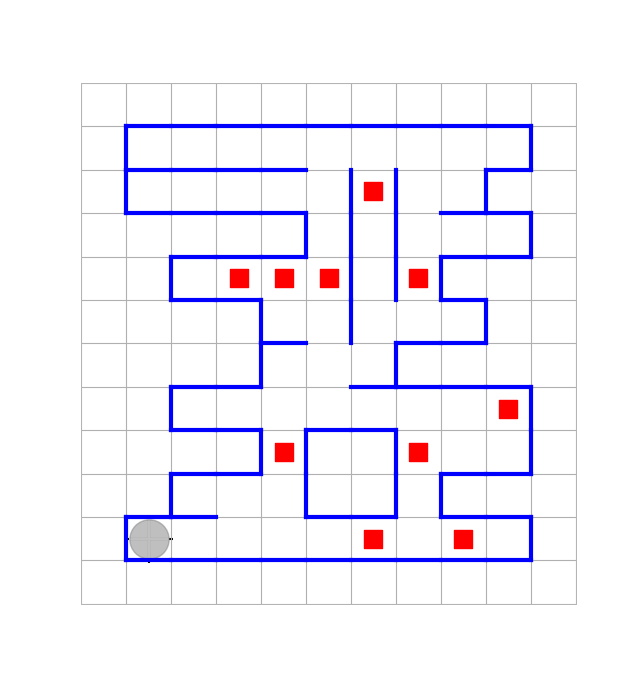
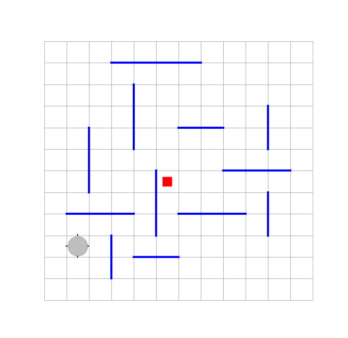

# Лекция 9 Обобщенное программирование в функциональном стиле (продолжение)

## Решение задачи о поиске маркера на неограниченном поле в функциональном стиле с использованием обобщенной функции `spiral!(action::Functional)`

В предыдущей лекции был спроектирован  модуль `TrajectorieRobot` и в нём была определена функция  `spiral!(action::Functional)`.

Чтобы вспомнить назначение модуля `TrajectorieRobot`, и  как пользоваться данной конкретной функцией этого модуля, воспользуемся вcтроенной системой помощи:

```julia
julia>?
help?> TrajectoriesRobot

Модуль TrajectoriesRobot содержит определения обобщенных функций, обеспечивающих перемещения Робота по специальным траекториям:

    snake!(move_fold!::Function, fold_direct::HorizonSide, general_direct::HorizonSide) - обеспечивает перемещение "змейкой" 
    comb!(there_and_back!::Function, clove_direct::HorizonSide, general_direct::HorizonSide) - обеспечивает перемещение по "гребенке"
    spiral!(move_act!::Function) - обеспечивает перемещение по спирали

Наличие араметров функционального типа у этих функций обеспечивают возможность их использования для решения самых разных задач, а также возможность перемешать Робота по соответствующим ттраектооиям как при отсутствии внутренних перегородок так и при их налаичии

help?> spiral

spiral!(move_act!::Function)

Перемещает Робота по раскручивающейся в положительном направлении спирали (первый шаг - на север) до момента наступления некотрого события, определяемого функцией move_act!(::HorizonSide)
-- move_act!(::HorizonSide)::Bool - функция перемещающая Робота в заданном направлении на 1 шаг (и, возможно, делающая что-то еще), и возвращая логическое значение: если возвращается false, то - это сигнал, чтобы движение "змейкой" было остановлено.
```

Остается только правильно воспользоваться полученной информацией. Текст программы, выполняющей поиск маркера на неограниченном поле содержится в файле ["example_9.1.jl"]() 

## Разработка нового модуля, расширяющего функциональность модуля `MovementsRobot` в сторону обеспечения обхода перегородок прямоугольной формы

В предыдущей лекции были разработаны модули `MovementsRobot` и `TrajectoriesRobot`, которые содержат обобщенные функции, обеспечивающие возможность перемещать Робота по различным траекториям и с выполнением требуемых дополнительных действий и до наступления заданного события .

Теперь мы хотели бы расширить функциональность нашего кода с тем, чтобы он справлялся со своими задачами и при наличие внутренних перегородок, например, прямоугольной формы.

Если присмотреться, то обнаруживается, что для этого требуется два момента.

1. Требуется, чтобы команда Робота `FunctionalRobot.move!(side)` , была переопределена так, чтобы если рядом с Роботом нет перегородки, то выполнялся бы обычный шаг в соседнюю клетку в заданном направлении, а если перегородка есть, и она изолированная и прямоугольной формы, то Робот, выполнив её обход, должен оказатьсь с другой стороны от этой пререгородки (на линии движения в заданном направлени). Причем, если соседняя перегородка является внешней рамкой, которую обойти нельзя, то команда `move(side)` должна будет состоять в том, что, после неудавшейся попытки совершить обход, Робот возвращается в исходное положение. И в любом случае эта команда должна будет возвращать логическое значение, сигнализирующее о том, что сделан шаг в заданном направлении (возвращается true) или нет (возвращается false).

2. Модуль `MovementsRobot` должен быть заменен на аналогичный модуль, но базирующийся на этой переопределенной указанным образом команде `move(side)`

Переопределение функции `move!` в контексте импортированного модуля `MovementsRobot` содержится в файле ["_rectangular_borders_move.jl"](_rectangular_borders_move.jl).

Соответствующий новый модуль `RectangularBordersRobot` определен в одноименном файле [`RectangularBordersRobot.jl`](RectangularBordersRobot.jl).

Этот новый модуль наследует от модуля `MovementsRobot` все его функции, за исключением

```julia
move!(side::Any)
movements!(side::Any)
movements!(action::Functional,side::Any)
get_num_mvements!(side::Any)
get_num_movements!(action::Functional,side::Any)
```

которые имеют прежнюю сигнатуру, но определяются заново (и таким образом эти новые определения "перекрывают" старые).

Но функции модуля `MovementsRobot`

```julia
movements!(side, num_steps::Integer)
movements!(action!::Function, side, num_steps::Integer) =
```

не переопределяются, но засчет использования вставок содержимого соотвествующих файлов

```julia
include("_rectangular_borders_move.jl")
# - здесь переопределена функция move!(::Any) в контексте импортированного модуля MovementsRobot

include("_movements_robot.jl")
# - здесь вставлены контекстно зависимые функции, которые теперь определены в сформированном выше контексте 
```

изменяется контекст их определения. Он теперь отличается от того контекста, который был в модуле `MovementsRobot` тем, что в новом контексте присутствует новое определение функции `move!(side::Any)`.

## Улучшение структуры кода без изменения его функциональности (рефакторинг)

Можно заметить, что структуру кода, содержащегося в модулях `MovementsRobot` и `RectangularBordersRobot` можно немного улучшить, избавившись от необходимости в модуле `RectangularBordersRobot` переопределять функции

```julia
movements!(side::Any)
movements!(action::Functional,side::Any)
get_num_mvements!(side::Any)
get_num_movements!(action::Functional,side::Any)
```

ранее определенные в модуле `MovementsRobot`. Эти новые определения понадобилось основаны на новом определении функции move!, способной обходить прямоугольные перегородки, если это внутренние перегродки, и при этом возвращающей логическое значение, сигнализирующее о выполнении или невыполнеии (вследствии невозможности) выполнения шага (в соседнюю клетку, или в обход внутренней  прямоугольной перегородки).

Этого можно было бы добиться, если новыми определениями этих функций, содержащимися в модуле `RectangularBordersRobot` заменить определения, с самого начала содержащиеся в модуле `MovementsRobot`. Но если сделать только это, то в контексте модуля `MovementsRobot` эти функции, конечно, не стали бы работать, т.к. новые определения предполагают, что функция `move!(side::Any)` возвращает логическое значение. Но модуль `MovementsRobot` наследует эту функцию от модуля `FunctionalRobot`, в котором функция `move!(side::Any)` всегда возвращает `nothing`.

Поэтому, чтобы новые определения функций заработали, в модуле `FunctionalRobot` функцию `move!(side::Any)` необходимо будет переопределить следующим образом:

```julia
HorizonSideRobots.move!(side)::Bool = isborder(side) ? false : (move!(ROBOT, side); true)
```

## Примеры решения задач, в условиях которых на поле имеются внутренние перегородки прямоугольной формы, с использованием модуля `RectangularBordersRobot`

### Подсчет числа маркеров  в простом лабиринте

Пусть начальная обстановка имеет вид: 

и требуеся посчитать число маркеров в простом лабиринте, внутри которого могут находиться также внутренние изолитрованные перегородки прямоугольной формы.

Программный код с решением задачи, использующий модуль `RectangularBordersRobot` находится в файле ["example_9.1.jl"](example_9.1.jl)

### Поиск маркера на неограниченном поле по спирали при наличии прямолинейных перегородок (конечной длины)

Модуль `RectangularBordersRobot` позволяет справиться и с задачей поиска маркера на неограниченном поле, на котором имеются также перегородки прямолинейной формы конечной длины (вырожденные прямоугольники). Вот пример соответствующей обстановки: 

Программный код с решением этой задачи, с использованием модуля `RectangularBordersRobot`, находится в файле ["example_9.2.jl"](example_9.2.jl)

Отличие от решения, не предусматривавшего наличие перегородок на поле, и содержащегося в файле ["../8/example_8.3.jl"](../8/example_8.3.jl) (см. конец [лекции 8](../8/TrajectoriesRobot.jl)), состоит лишь в том, что теперь вместо модуля `TrajectoriesRobot` был импортирован модуль `RecnangularBordersRobot`.

### Поиск маркера на неограниченном поле по спирали при наличии прямолинейных полубесконечных перегородок

Чтобы в задаче поиска маркера на неограниченном поле справиться с наличием полубесконечных прямолинейных перегородок моодуля `RecnangularBordersRobot` будет уже не достаточно. Для этого случая потребуется соответствующим образом переопределить функции move! в отдельном модуле, который мы затем сможем использовать для решения нашей задачи.

Программный код с решением этой задачи, с использованием модуля `RectangularBordersRobot`, находится в файле ["example_9.3.jl"](example_9.3.jl)

От предыдущего случая это решение отличается тем, что, во-первых, для обхода полубесконечных перегородок написана специальная функций, с помощь которой определяется функция, которая уже передается как функциональный параметр функции высшего порядка `spiral!`. Во-вторых, вместо модуля `RectangularBordersRobot` используется просто модуль `TrajectoriesRobot`.

### Поиск маркера на неограниченном поле по спирали при наличии конечных прямоугольных перегородок

Функции высшего порядка `spiral!`, определенная в модуле `TrajectoriesRobot`, аналогично предыдущему  примеру может быть использована и для поиска маркера на неограниченном поле, при наличии на нём изолированных прямоугольных пергородок конечной длины. 

Ранее была решена задача только для случая наличия вырожденных прямоугольных перегородок. В случае прямоугольных перегородок общего вида то решение не годится. 

Новая сложность состоит в том, что если прямоугольник, который на очередном шаге требуется обойти, не вырождаен в отрезок, то невозможно будет переместиться в соседнюю клетку. Обходы же прямоугольных перегородок с помощью модуля `RectangularBordersRobot` тоже не решает проблемы, потому что при движении по спирали конечное положение Робота (после выполнения одного шага) не всегда должно быть с другой стороны прямоугольника: оно также может оказаться и на ботковой стороне прямоугольника и даже - на первоначально обоащенной к Роботу.

Но если перед тем, как сделать очередной шаг с обходом прямоугольника (в некотором направлении), предварительно определить его размеры, а также если вычислять деакртовы коорднаты текущего положения Робота относительно центра "раскручиваемой спирали", то можно вычислять конечное положение Робота при обходе каждого прямоугольника и сразу перемещать в него Робота. И при этом надо еще будет вычислить сколько воображаемых "шагов по спирали" надо пропустить, чтобы снованачать перемещать робота по продолжению спирали.

Все эти действия следует оформить в виде вспомогательной функции, которую надо будет передавать через соответсвующий параметр в функцию высшего порядка `spiral!`, определенную в модуле `TrajectoriesRobot`.
