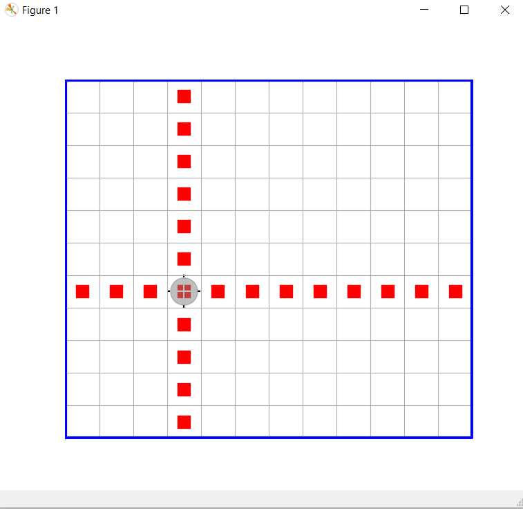

# ЛЕКЦИЯ 1
СОДЕРЖАНИЕ
- [ЛЕКЦИЯ 1](#лекция-1)
  - [1. О целях и содержании курса](#1-о-целях-и-содержании-курса)
  - [2. О языке программирования Juliа](#2-о-языке-программирования-juliа)
  - [3. О исполнителе "Робот на клетчатом поле со сторонами горизонта"](#3-о-исполнителе-робот-на-клетчатом-поле-со-сторонами-горизонта)
  - [4. Технология проектирования](#4-технология-проектирования)
    - [**4.1. Пример решения в плохом стиле**](#41-пример-решения-в-плохом-стиле)
    - [**4.2. Пример достаточно хорошо структурированного кода**](#42-пример-достаточно-хорошо-структурированного-кода)
    - [**4.3. Технология проектирования «сверху вниз»**](#43-технология-проектирования-сверху-вниз)
    - [**4.5. Отладка программы по технологии «снизу вверх»**](#45-отладка-программы-по-технологии-снизу-вверх)
    - [**4.6. О составлении описаний функций**](#46-о-составлении-описаний-функций)
    - [**4.7. Функции и файлы**](#47-функции-и-файлы)
    - [**4.8. Аннотирование аргументов функции и множественная диспетчеризация**](#48-аннотирование-аргументов-функции-и-множественная-диспетчеризация)

-----------------------

[<< README](../README.md)

------------------------

## 1. О целях и содержании курса

Цель курса в 1-ом семестре - научить писать хорошо структурированный программный код, с использованием технологии проектирования "сверху вниз" и на базе так называемого обобщенного подхода к программированию. В следующем семестре акцент будет смещен в большей степени в сторону собственно алгоритмов. Программировать будем на языке Julia.

Курс состоит из **лекционных** и ***практических** аудиторных занятий и **самостоятельных** занятий дома. 

## 2. О языке программирования Juliа

Начальные сведения о языке программирования Julia, необходимые для того, чтобы приступить к выполнени заданий, приведены [здесь](https://github.com/Vibof/HorizonSideRobots.jl/blob/master/content/language.md)

## 3. О исполнителе "Робот на клетчатом поле со сторонами горизонта"

Информация о том, как установить Робота на компьютере, как импортировать соответствующий модуль, и о командном интерфейсе Робота находится [здесь](https://github.com/Vibof/HorizonSideRobots.jl)

## 4. Технология проектирования

Рассмотрим пример. Пусть требуется решить следующую задачу.

**ДАНО:** Робот находится в произвольной клетке ограниченного прямоугольного поля без внутренних перегородок и маркеров.

**РЕЗУЛЬТАТ:** Робот — в исходном положении в центре прямого креста из маркеров, расставленных вплоть до внешней рамки.



### **4.1. Пример решения в плохом стиле**

При неискушенном подходе к программированию вероятнее всего появился бы программный код, подобный следующему.

```julia
function mark_kross!(r::Robot)
    while isborder(r,Nord)==false
        move!(r,Nord)
        putmarker!(r)
    end
    while ismarker(r)==true
        move!(r,Sud)
    end
    while isborder(r,Sud)==false
        move!(r,Sud)
        putmarker!(r)
    end
    while ismarker(r)==true
        move!(r,Nord)
    end
    while isborder(r,Ost)==false
        move!(r,Ost)
        putmarker!(r)
    end
    while ismarker(r)==true
        move!(r,West)
    end
    while isborder(r,West)==false
        move!(r,West)
        putmarker!(r)
    end
    while ismarker(r)==true
        move!(r,Ost)
    end
    putmarker!(r)
end
```

Приведенный здесь код дает решение задачи. Но что можно сказать про качество этого кода с точки зрения профессионального подхода к программированию - этот код плохо структурирован (!). Признаком этого является наличие в нем практически повотряющихся блоков (фрагментов), причем каждый такой фрагмент в нашем конкретном случае повторяется по 4 раза.

Обычно плохо структурированный код с повторами одних и тех же последовательностей действий получается, если пытаться записать алгоритм сразу во всех его деталях, мысля этот алгоритм НЕПОСРЕДСТВЕННО как последовательность команд исполнителя.

При правильном же подходе к программированию целью должно быть не просто написать код, который хоть как-нибудь даст решение данной конкретной задачи, но написать его так, чтобы он был при этом еще и *хорошо структурирован*. Это особенно важно, если предполагается дальнейшая модернизация кода и/или работа в команде программистов. Ну и просто — если иметь целью научится с минимальными усилиями писать надёжно работающие программы, в которых сможет разобраться кто-нибудь ещё, кроме их автора (и то лишь на момент разработки). Программистам хорошо известно, что уже спустя довольно короткий интервал времени свой собственный код начинает восприниматься как чужой.

Но чтобы этому научиться, требуется приложить определенные усилия, перебарывая в себе, в общем-то, вполне естественное желание в творческом порыве, никого не слушая, всё делать по-своему.

-------------

[<< к началу](#лекция-1)

### **4.2. Пример достаточно хорошо структурированного кода**

Ниже приведён код на языке Julia, который соответствует данным требованиям. Примерно такой код (конечно, тут возможны варианты), скорее всего, должен получиться, если следовать технологии проектирования «сверху вниз».

Код в данном случае состоит из главной функции и трёх вспомогательных (подпрограмм):
```julia
function mark_kross!(r::Robot) # - главная функция  
    for side in (HorizonSide(i) for i=0:3) # - перебор всех возможных направлений
        putmarkers!(r,side)
        move_by_markers(r,inverse(side))
    end
    putmarker!(r)
end

# Всюду в заданном направлении ставит маркеры вплоть до перегородки, но в исходной клетке маркер не ставит
putmarkers!(r::Robot,side::HorizonSide) = while isborder(r,side)==false 
    move!(r,side)
    putmarker!(r)
end

# Перемещает робота в заданном направлении пока, пока он находится в клетке с маркером (в итоге робот окажется в клетке без маркера)
move_by_markers(r::Robot,side::HorizonSide) = while ismarker(r)==true 
    move!(r,side) 
end

# Возвращает направление, противоположное заданному
inverse(side::HorizonSide) = HorizonSide(mod(Int(side)+2, 4)) 
```
Обычно определение функции стоит дополнять кратким комментарием, пояснящим назначение функции. В данном примере это строки, начинающиеся с символа «`#`».

Стоит обратить внимание, что некоторые названия функций завершаются символом «`!`». Дело в том, что в языке Julia действует неформальное соглашение (то есть нарушать его можно, компилятор стерпит, но лучше не стоит), согласно которому все функции, изменяющие (точнее, потенциально способные изменять) данные, содержащиеся в их получаемых по сслылке аргументах, следует именовать с восклицательным знаком в конце. И только если функция гарантированно не изменяет получаемые по ссылке данные, восклицательный знак к её имени не добавляется.

-------------

[<< к началу](#лекция-1)

### **4.3. Технология проектирования «сверху вниз»**

Как уже упоминалось, записанный выше программный код может быть получен путем проектирования по технологии «сверху вниз». Это основная технология, применяющаяся в программировании. Суть её в следующем.

- Исходная задача должна быть расчленена на ряд подзадач (более простых), каждой из которых будет соответствовать некоторая вспомогательная функция.
- Каждой выделенной подзадаче (функции) должно быть присвоено имя и определено, какие потребуются для неё входные данные и какие — выходные. Входные данные, как правило, будут представляться параметрами функции, а выходные - кортежем возвращаемых ею значений.
- После этого, используя только имена выделенных вспомогательных функций, следует записать алгоритм решения всей задачи. Причём сделать это так, как будто бы эти выделенные вспомогательные функции уже реализованы. Очень важный момент здесь заключается в том, что к реализации вспомогательных функций надо переходить уже только после того, как выполнен данный пункт. Во-первых, потому, что может оказаться, что декомпозиция задачи была произведена неудачно, и с помощью выделенных подпрограмм не удаётся получить желаемое решение. Во-вторых, потому, что иначе, из-за преждевременного переноса внимания на подпрограммы, происходит отвлечение от основной задачи, и в результате этого могут появиться ошибки, связанные с искажением задуманной схемы взаимодействия программных блоков.
- Далее каждая из выделенных подзадач решается в точности по той же схеме. Этот процесс, который можно назвать процессом ПОСЛЕДОВАТЕЛЬНОЙ ДЕТАЛИЗАЦИИ алгоритма, завершается когда выделяемые подзадачи не начнут совпадать с командами исполнителя (в нашем случае — Робота).
  
Сам по себе процесс расчленения задачи на подзадачи является творческим и, по крайней мере на практике, не формализуется. Варианты расчленения тоже могут быть разными, проблема состоит в том, чтобы найти наиболее удачный способ. 

Иногда процесс расчленения (он также называется декомпозицией) может зайти в тупик. Т.е. может оказаться, что реализовать все желаемые подпрограммы не удается, или реализация какой-либо из них оказывается слишком затратной. Тогда придётся вернуться к самому началу и пытаться найти другой более подходящий путь решения проблемы.

На начальном этапе декомпозиции бывает целесообразно использовать так называемый псевдокод: неформальую запись алгорима, часто в виде смеси языковых конструкций с почти обычным текстом. В данном случае первоначальный псевдокод мог бы выглядеть, например, так:
```julia
for side - очередное (одно из 4х) направление горизонта
    ставить маркеры до упора в направлении side
    вернуться назад по расставленным маркерам
end
поставить маркер
```
На следующем шаге проектирования появляется уже приведённый выше вполне формальный код:
```julia
function mark_kross!(r::Robot) # - главная функция  
    for side in (HorizonSide(i) for i=0:3) # - перебор всех возможных направлений
        putmarkers!(r,side)
        move_by_markers(r,inverse(side))
    end
    putmarker!(r)
end
```
После чего уже должны быть по очереди реализованы все задуманные здесь вспомогательные функции. В нашем случае они оказались уже достаточно простыми, чтобы быть реализованными сразу, без предварительного использования псевдокода.

Приведенное выше решение, однако, не является единственно возможным. Так, функцию putmarkers! можно было бы реализовать ещё и так:
```julia
putmarkers!(r::Robot, side::HorizonSide) = while move_if_possible!(r, side) == true
    putmarker!(r)
end
```
при этом появляется ещё одна вспомогательная функция:
```julia
# Перемещает робота в заданном направлении, если это возможно, и возвращает true,
# если перемещение состоялось; в противном случае - false.
move_if_possible!(r::Robot, side::HorizonSide)::Bool = if isborder(r, side)
    return false
else 
    move!(r,side)
    return true
end
```
Такое решение будет иметь преимущество перед прежним, если иметь в виду, что в дальнейшем может понадобится усовершенствовать функцию `mark_kross!` так, чтобы она работала и при наличии на поле внутренних перегородок. Потому что это позволило бы тогда ограничиться модернизацией только функции `move_if_posible`, оставив весь остальной код без изменений.

В связи со сказанным может возникнуть вопрос, а до какой степени следует "измельчать" подзадачи. Ответ состоит в том, что целью всегда должно быть избавление от повторения кодирования последовательности одних и тех же действий. Поэтому любая логически завершенная последовательность действий, которая повторяется в разных частях программы (или только потенциально могла бы повторяться, или даже только могла бы встретиться в других программах), должна быть выделена в отдельную подпрограмму. Такие подпрограммы могут быть совсем короткими, содержащими только какой-то цикл, например. Кроме того, такие подпрограммы могут снабжаться какими-то параметрами, чтобы быть более универсальными. На самом деле, кроме введения параметров, есть еще и другой способ повышения универсальности подпрограмм - он реализуется на пути так называемого обобщенного программирования, но пока мы на некоторое время отложим обсуждение этого вопроса.


-------------

[<< к началу](#лекция-1)

### **4.5. Отладка программы по технологии «снизу вверх»**


Если процесс проектирования может быть охарактеризован как «технология сверху вниз», то процесс отладки должен происходить «снизу вверх». Суть этого утверждения в том, что прежде чем начинать отладку функции более высокого иерархического уровня, использующей какие-либо подпрограммы, эти подпрограммы должны быть уже отлажены. Поэтому отладка должна начинаться с подпрограмм самого нижнего иерархического уровня и заканчиваться уже отладкой главной функции.

Если следовать этому принципу, то процесс поиска и исправления ошибок будет максимально облегчён. При этом, если стремиться к тому, чтобы  вспомогательные функции были как можно более простыми, то и отлаживать (находить возможные ошибки) их будет просто.

### **4.6. О составлении описаний функций**

В процессе проектирования и отладки (и для дальнейшего использования) очень важно научиться чётко и, по возможности, кратко формулировать, что именно делает каждая вспомогательная функция. Такие формулировки следует фиксировать в виде соответствующих коментариев к заголовкам функций. 

Эти формулировки в том или ином виде должны заключать в себе пункты: **ДАНО** и **РЕЗУЛЬТАТ**, подобно тому, как это имеет место в приведенной в самом начале формулировки задачи. Хотя реальные формулировки могут и не включать явно этих слов, но **ДАНО** и **РЕЗУЛЬТАТ** должны легко выводиться из записанных в формулировках утверждений.

Некоторая сложность при составлении таких формулировок может заключаться в необходимости составления их так, чтобы они соответствовали *всем возможным* случаям применения соответствующих функций. Причем формулировки эти должны быть *полными*: каждая мелочь может иметь решающее значение.

-------------

[<< к началу](#лекция-1)

### **4.7. Функции и файлы**

Хотя определения функций и могут быть сделаны непосредственно в REPL, обычно все нужные определения, решающие задачу, размещают и хранят в отдельном файле, или в нескольких файлах. Пусть в нашем случае такой файл будет иметь имя `example.jl`. Тогда, чтобы выполнить функцию `mark_kross!` из REPL нужно будет определения этой и вспомогательных для неё функций вставить в REPL с помощью include("example.jl"). Вот вся последовательность необходимых действий:

```julia
julia> using HorizonSideRobots
```
Модуль HorizonSideRobots экспортирует перечисление HorizonSide, содержащее символы Nord, Sud, Ost, West,  и определения следующих функций:
```julia
    moves!(::Robot, ::HorizonSide)
    moves!(::Robot, ::HorizonSide, ::Int)
    find_border!(::Robot, ::HorizonSide, ::HorizonSide)
    inverse(::HorizonSide)
    putmarkers!(::Robot, ::HorizonSide)
    putmarkers!(r, direction_of_movement, direction_to_border)
```
Далее

```julia
lulia> r=Robot(animate=true) # возможно редактирование обстановки 
julia> include("example.jl")
julia> mark_kross!(r)
```
Разумеется, после внесения каких-либо изменений в файл `example.jl` перед повторным вызовом `mark_kross!(r)` необходимо будет заново выполнить `include("example.jl")`. Причём, поскольку файл `example.jl` содержит лишь определения функций вне отдельного модуля (в языке Julia есть специальная синтаксичская конструкция — `module`, ограничивающая область видимости имён, и которая в данном случае не используется), то перезапуск REPL julia не потребуется.

### **4.8. Аннотирование аргументов функции и множественная диспетчеризация**

Во всех приведенных здесь примерах в определениях функций типы их аргументы были аннотированы. Однако в языке Julia такая аннотация не является обязательной. То есть, можно было бы и не указывать типы аргументов функций, так же как это, например, имеет место быть в языке Python. Поэтому, если во всех приведенных примерах функций убрать аннотацию типов аргументов, то по-прежнему всё будет работать. 

Возможность аннотирования типов даёт следующие преимущества.

- Функции с одним и тем же именем, но с разными типами аргументов (и/или разным количеством аргументов) — это разные функции (в терминологии Julia — разные методы одной функции). Это то, что называется [множественной диспетчеризацией](https://ru.wikipedia.org/wiki/Мультиметод). Множественная диспетчеризация позволяет иметь специализированные вырианты (методы) функции для каждого набора типов аргументов, то есть выполнять те или иные действия, в зависимости от их типов.
- Заголовок определения функции с аннотированными типами аргументов делает более понятным их назначение (но отсутствие аннотирования всегда можно компенсировать в этом смысле подробным документированием самой функции).
- Аннотирование типов аргументов предохраняет от потенциальных ошибок использования функции. Причём, что особенно ценно, такого рода ошибки могут быть обнаружены анализатором кода ещё на этапе подготовки программы. Однако отсутствие аннотирования аргументов функции компенсируется в этом смысле тем, что ошибки типизаци обычно (но не всегда) легко выявляются при отладке программы.

Вообще, типы бывают абстрактными и конкретными. Все типы аргументов в приведённых примерах — конкретные. Абстрактные типы предназначены исключительно для создания иерархии типов путём использования механизма наследования. 

Использование конкретных типов при аннотировании аргументов функций - не всегда правильное решение, потому что это препятствует обобщённому подходу к программированию, основанному на так называемых обобщённых функциях. Цель разработки обобщённой функции — сделать сферу её применения максимально широкой без изменения кода реализации. Однако то, в каких именно случаях, и как лучше всего аннотировать аргументы функций, и как программировать обобщённо — это предмет последующего отдельного обсуждения.

-------------

[<< к началу](#лекция-1)